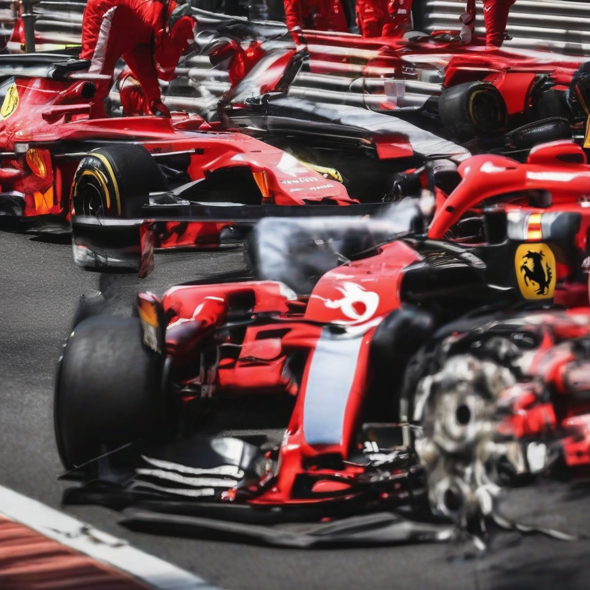

Title: "Ferrari's F1 Future in Jeopardy as Team Suffers Another Disappointing Finish at Monaco"
Date: 2024-07-08 18:17
Category: autosports

> This article is AI generated!

Ferrari's struggles in the 2023 Formula 1 season showed no signs of improvement as the team suffered another disappointing finish at the iconic Monaco Grand Prix. Lewis Hamilton took the pole position, but Antonio Giovinazzi took an early lead, only to suffer mechanical issues that forced him to retire. It marked the sixth consecutive race that Ferrari has failed to score a podium finish, casting a long shadow over the team's future in the sport.