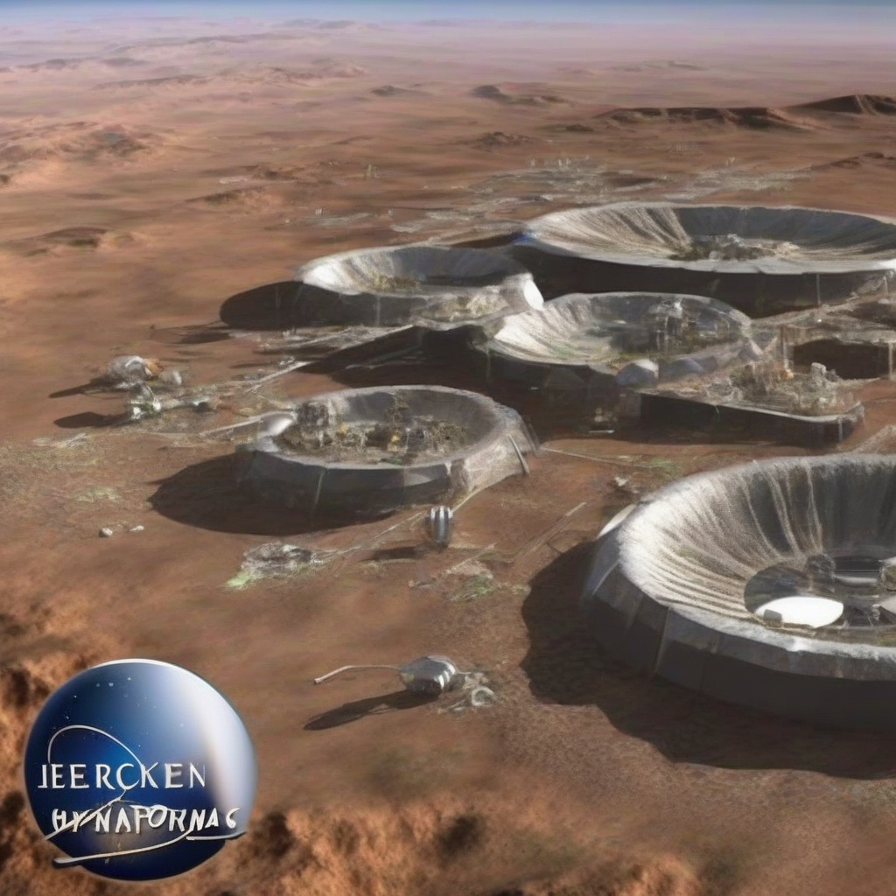

Title: "New Horizons for Human Settlement: NASA Announces Breakthrough in Terraforming Technology"
Date: 2024-07-08 17:34
Category: space exploration

> This article is AI generated!

According to NASA officials, the new technology is designed to alter the atmospheric composition of a planetary body, making it more conducive to human life. The system uses a combination of advanced atmospheric processors and nanotechnology to break down harmful gases, such as carbon dioxide and nitrogen, and replace them with breathable oxygen and nitrogen. This process would not only make the environment habitable but also create a self-sustaining ecosystem, allowing humans to thrive on the new planet.