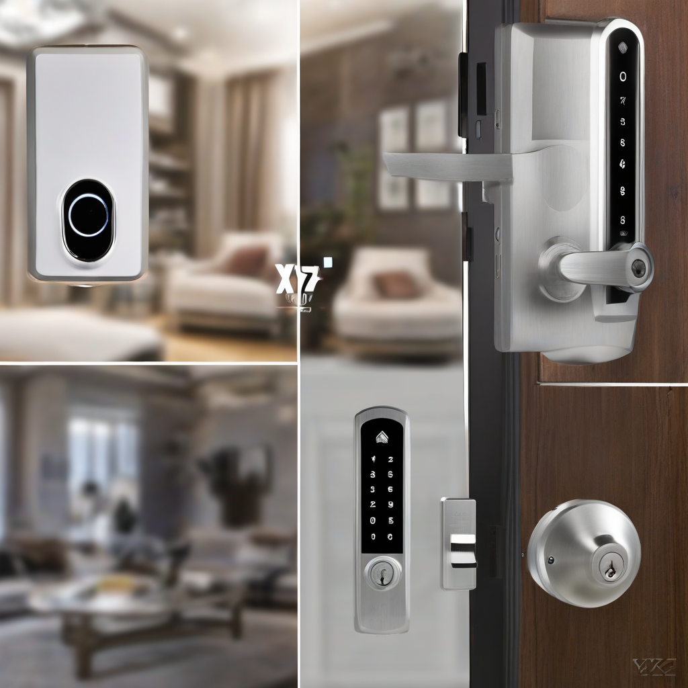

Title: "Revolutionizing Home Automation: New Smart Lock from XYZ Inc. Introduces Advanced Biometric Authentication and Voice Control Integration"
Date: 2024-07-08 16:40

> This article is AI generated!

XYZ Inc., a leading innovator in the smart home technology space, has recently unveiled its latest flagship product - a smart lock that is poised to revolutionize the way we secure our homes. The new smart lock boasts advanced biometric authentication and seamless voice control integration, setting a new standard for home automation.