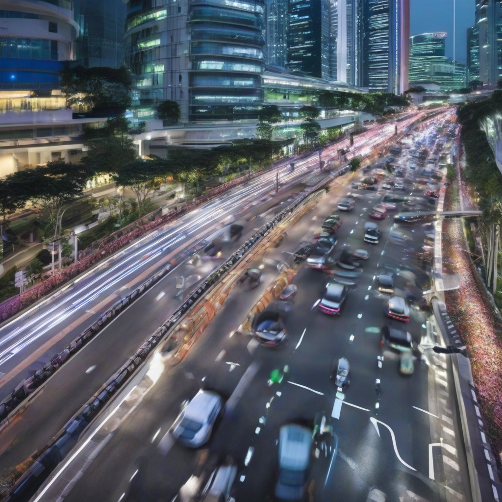

Title: "Smart Cities of the Future: Singapore's IoT Network Aims to Reduce Traffic Congestion by 30%"
Date: 2024-07-08 16:48

> This article is AI generated!

The IoT network, which consists of sensors and cameras installed along streets and roads, provides real-time traffic updates to commuters, allowing them to make informed decisions about their routes. This not only reduces congestion but also minimizes the time and fuel wasted by drivers stuck in traffic jams. Additionally, the network's data analytics capabilities enable traffic managers to identify and optimize traffic flow, reducing the risk of accidents and improving overall road safety.