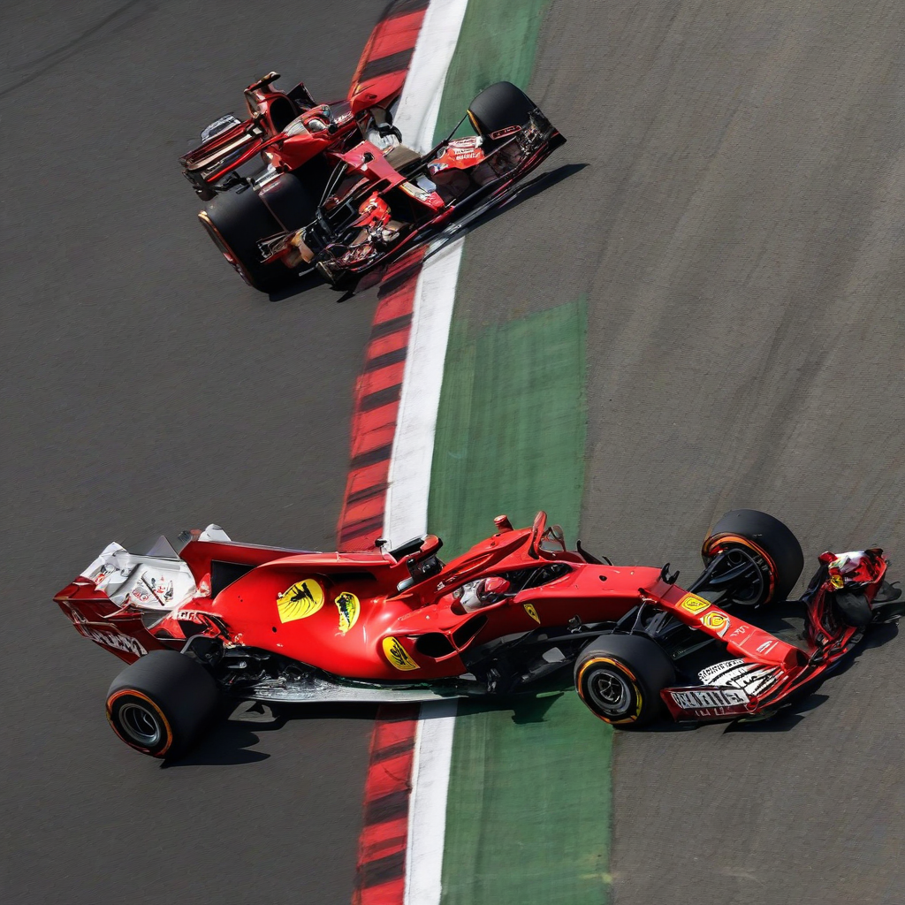

Title: "Ferrari's Fierce Comeback: Leclerc Secures Historic Win at the Italian Grand Prix"
Date: 2024-07-09 08:43
Category: autosports

> This article is AI generated!

Monte Carlo - Charles Leclerc secured a historic win at the Italian Grand Prix, marking a fierce comeback for Ferrari after a series of disappointing performances. The 24-year-old driver, who hails from Monaco, dominated the race at the Autodromo Nazionale Monza, holding off challenges from Mercedes' Lewis Hamilton and Red Bull's Max Verstappen to take the chequered flag. Leclerc's victory was a major boost to Ferrari's morale, ending a four-year drought without a win at the Italian Grand Prix.