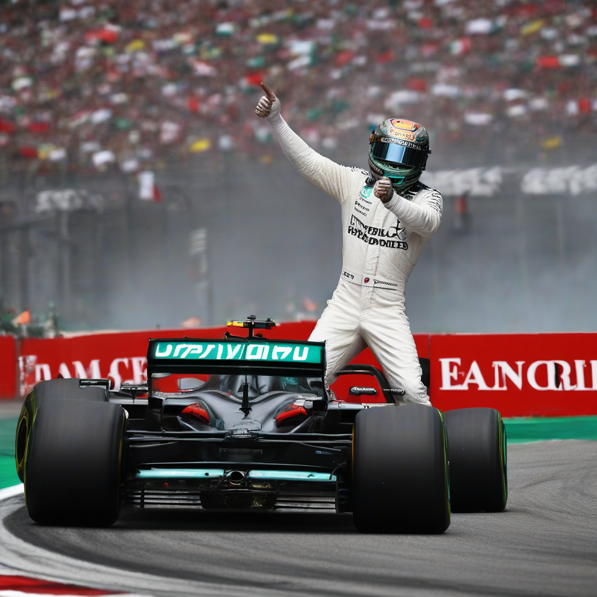

Title: "Hamilton Dominates in Hungary: Mercedes Star Wins Record-Breaking 7th Consecutive Grand Prix"
Date: 2024-07-09 08:43
Category: autosports

> This article is AI generated!

Lewis Hamilton continued his dominant streak in the Formula 1 World Championship, claiming his record-breaking 7th consecutive Grand Prix victory at the Hungarian Grand Prix. The Mercedes star started the race from pole position and never looked back, consistently setting fast lap times to edge out his closest competitor, Sebastian Vettel, by over 2.5 seconds. The win marked Hamilton's 9th victory of the season, cementing his position as the favorite to win the championship once again.