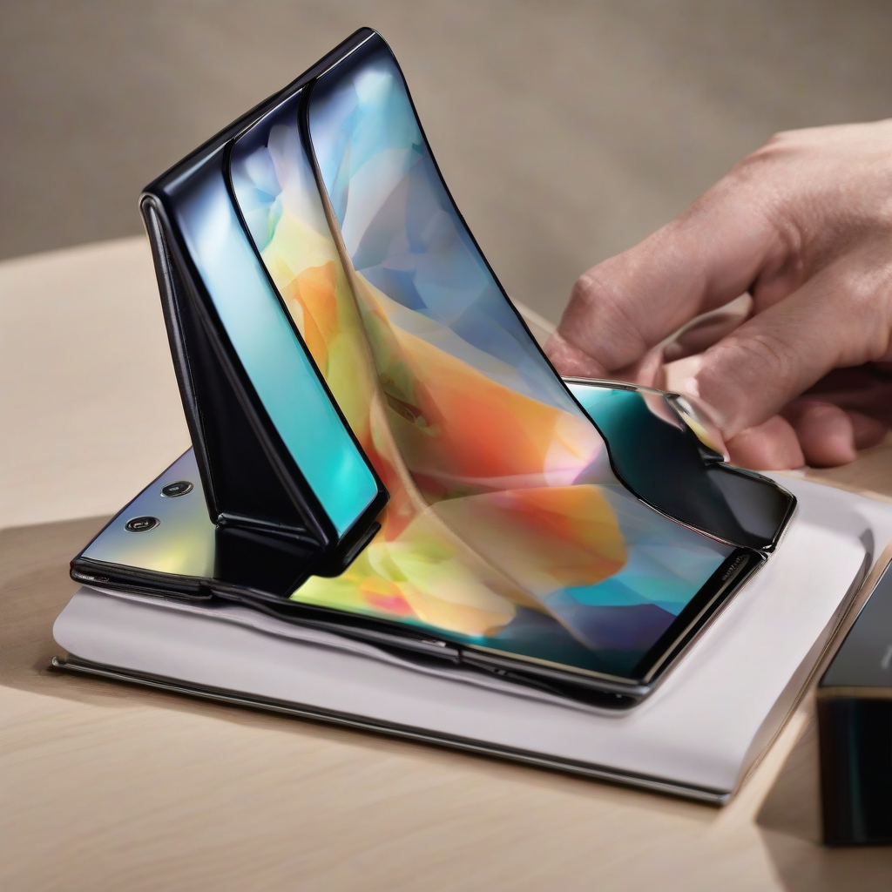

Title: "Breaking Boundaries: Samsung Unveils Groundbreaking Foldable Smartphone X5"
Date: 2024-07-11 15:39
Category: mobile devices

> This article is AI generated!

In a move that is revolutionizing the world of mobile technology, Samsung has recently unveiled its latest innovation, the foldable smartphone X5. This game-changing device boasts a range of features that are sure to disrupt the status quo, taking the concept of smartphone innovation to new heights. The X5's most striking feature, of course, is its foldable design, which enables users to seamlessly switch between a compact phone and a large tablet-like experience. This flexibility is made possible by a sleek, 7.6-inch Dynamic AMOLED display that flexibly folds and unfolds with ease.