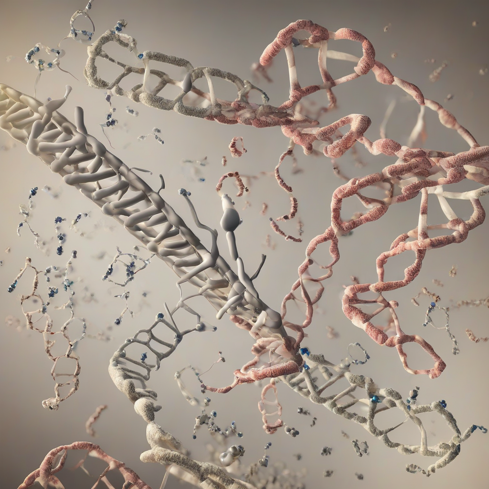

Title: "Breakthrough in Gene Editing Technology Showcases Promise for Curing Genetic Disorders"
Date: 2024-07-11 15:51
Category: biotech

> This article is AI generated!

In a major breakthrough in the field of genetics, scientists have made a significant leap forward in gene editing technology, raising hopes for the curing of genetic disorders that have long plagued humanity. The innovative technique, known as "Prime Editing," has the potential to correct genetic mutations more efficiently and accurately than previous methods, allowing for the treatment of a range of diseases caused by genetic mutations, including sickle cell anemia, cystic fibrosis, and muscular dystrophy. This breakthrough has the potential to improve the quality of life for millions of people around the world who are affected by these debilitating conditions.