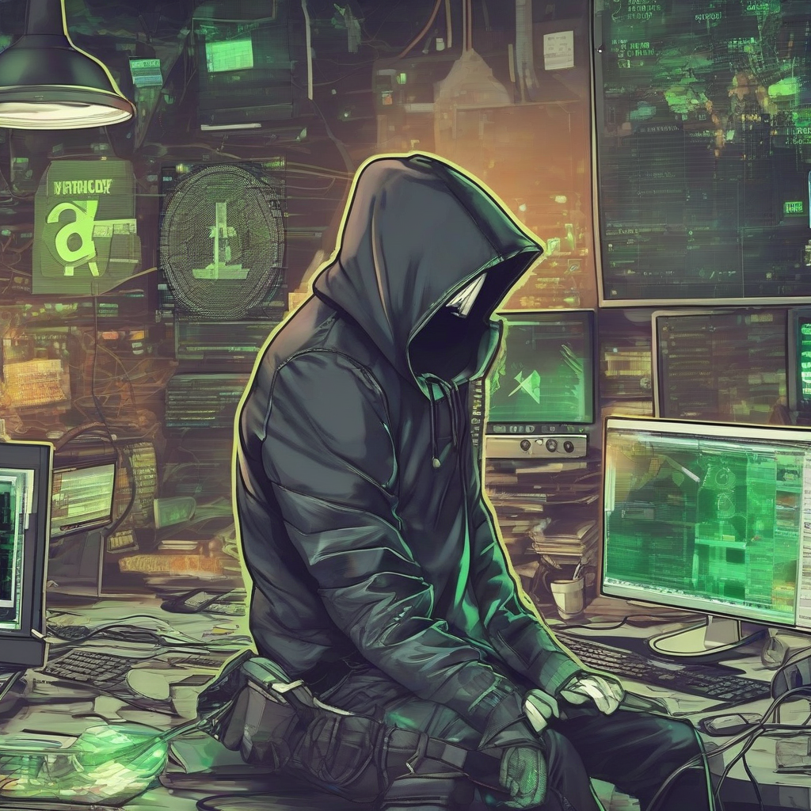

Title: " deviantART Assets Stolen in Major Hack, Hackers Demand Ransom in Cryptocurrency"
Date: 2024-07-11 15:35
Category: gaming

> This article is AI generated!

DeviantART, a popular online community for artists and designers, has been hit with a major hack, resulting in the theft of numerous assets from the platform's gallery. The hack, which occurred on Tuesday morning, affected a significant number of user accounts, with hackers gaining unauthorized access to a vast collection of digital art, including illustrations, animations, and photographs. The stolen assets are valued in the thousands of dollars, and their theft has sent shockwaves through the community, with many artists expressing outrage and concern over the loss of their work.