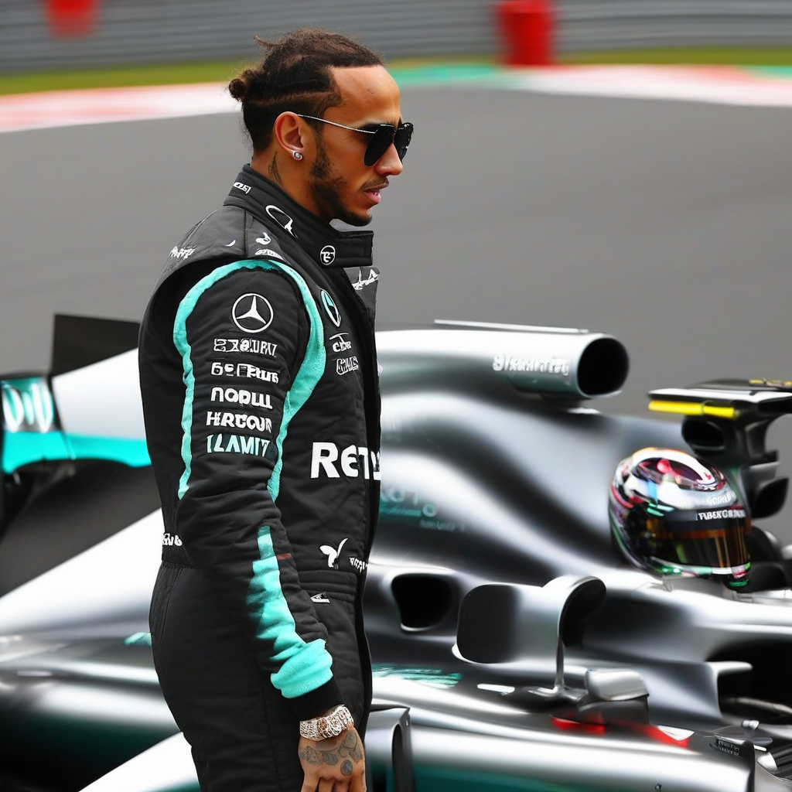

Title: "Reigning Champion Lewis Hamilton Makes Shocking Announcement, Slams the Brakes on Racing Career"
Date: 2024-07-11 15:46
Category: autosports

> This article is AI generated!

In a stunning turn of events, Lewis Hamilton, the reigning Formula 1 World Champion, has made the shocking announcement that he is retiring from the sport. The news sends shockwaves through the motorsport community as fans and colleagues alike struggle to come to terms with the sudden departure of one of the most successful and technically gifted drivers of all time. Hamilton, 38, has won the Formula 1 World Championship a record seven times, including the last three seasons, and has consistently been one of the top performers on the grid throughout his illustrious career.