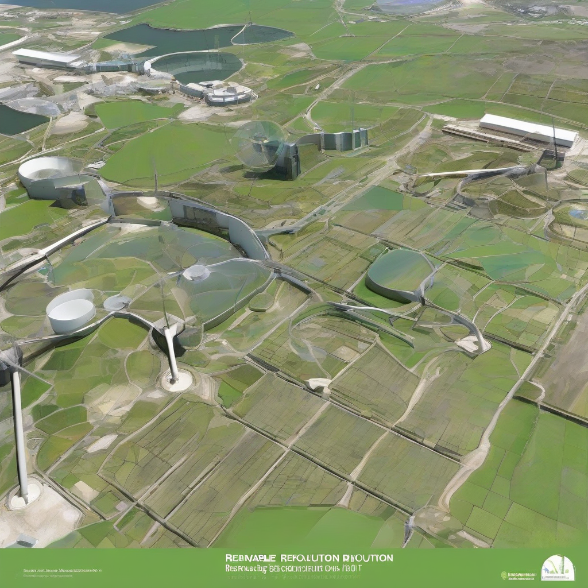

Title: "Renewable Revolution: Breaking Down Barriers to a Sustainable Future"
Date: 2024-07-11 15:51
Category: green energy

> This article is AI generated!

One of the key breakthroughs driving the renewable revolution is the dramatic decline in the cost of solar and wind power. What was once a luxury reserved for wealthy countries is now within reach of developing nations and even individual households. As a result, renewable energy is becoming a mainstream option, with solar and wind power already accounting for over 30% of global electricity production. Furthermore, advances in energy storage and grid management are ensuring that these intermittent power sources can be reliably integrated into the grid, making them a viable alternative to traditional fossil fuels. With the cost of renewable energy projected to continue falling, it's only a matter of time before it becomes the dominant player in the global energy market.