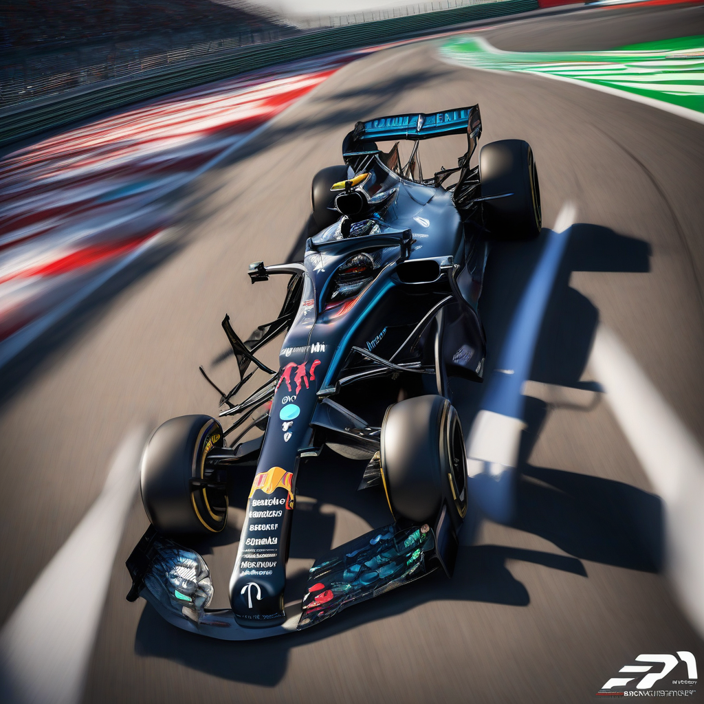

Title: "Rolling Start: Formula 1 Announces Historic Partnership with Energy Giant to Power the Future of Racing"
Date: 2024-07-11 15:51
Category: autosports

> This article is AI generated!

In a groundbreaking move, Formula 1 has announced a historic partnership with leading energy giant, ENERGIX, to power the future of racing. The agreement, which marks a significant milestone in the world of motorsport, will see ENERGIX supply Formula 1 with sustainable energy solutions for the next five years. This partnership not only strengthens the championship's commitment to environmental sustainability but also underscores ENERGIX's dedication to driving innovation and reducing carbon emissions across various industries.