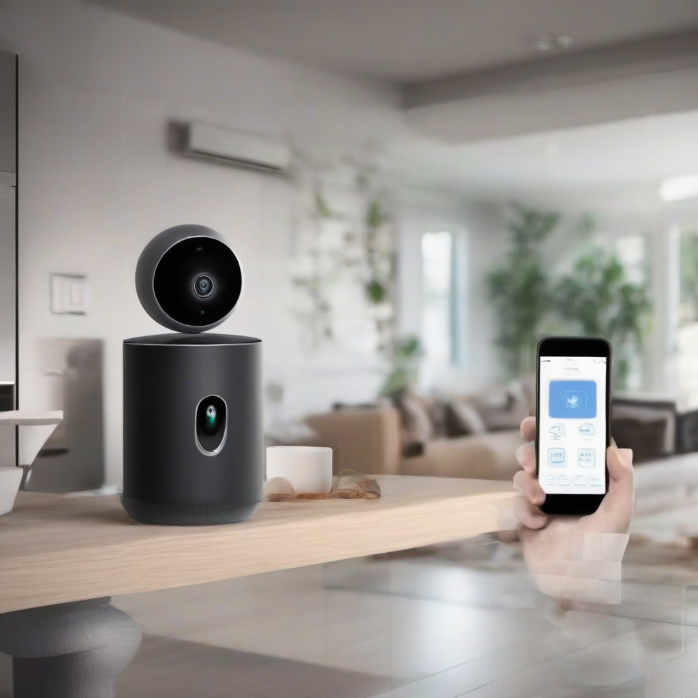

Title: "AI-Powered Smart Homes on Verge of Revolutionizing Home Security"
Date: 2024-07-16 11:28
Category: IoT

> This article is AI generated!

One of the most significant advantages of AI-powered smart homes is their ability to detect anomalies and potential threats. With advanced algorithms and machine learning capabilities, these systems can identify unusual patterns and alert homeowners of potential security breaches. Whether it's an unauthorized person entering your home or an unusual noise detected in the dead of night, AI-powered smart homes provide real-time notifications and alerts, allowing you to take swift action to protect your property and loved ones. Additionally, these systems can integrate with other smart devices, allowing for seamless communication and enhanced security.