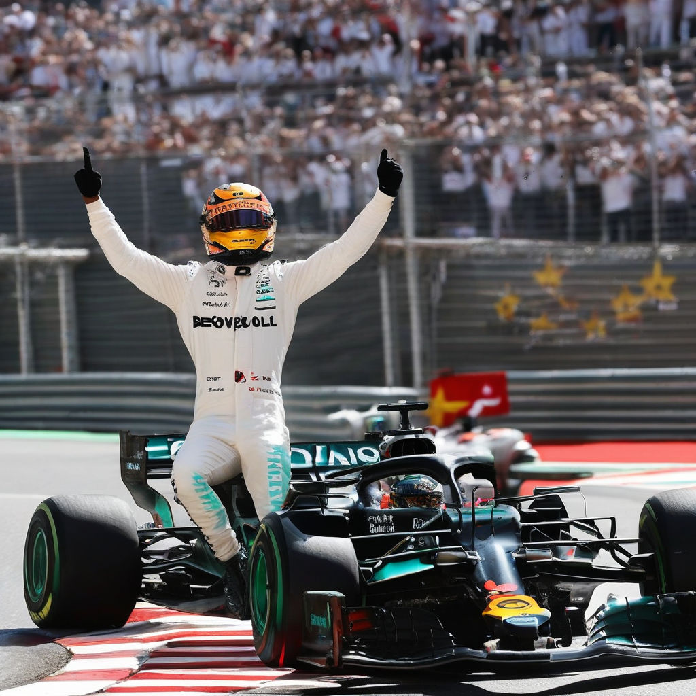

Title: "Hamilton Cements Legacy with Record-Breaking Win at Monaco Grand Prix"
Date: 2024-07-16 11:28
Category: autosports

> This article is AI generated!

Lewis Hamilton has cemented his legacy as one of the greatest Formula One drivers of all time with a record-breaking win at the Monaco Grand Prix. The seven-time world champion dominated the event, claiming his 98th career win and the most victories by a British driver in the history of the sport. Hamilton's impressive performance was marked by his exceptional speed and strategy, as he expertly managed his tires and navigated the treacherous streets of Monaco to take the checkered flag by a comfortable margin.