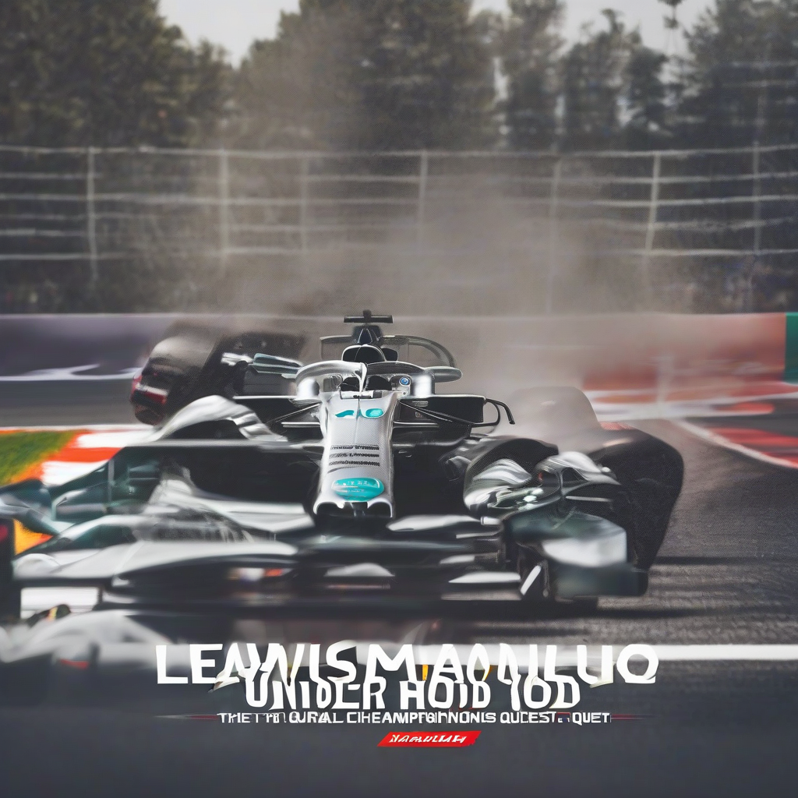

Title: "Under the Hood: Exclusive Interview with Lewis Hamilton on his Formula 1 Championship Quest"
Date: 2024-07-17 08:06
Category: autosports

> This article is AI generated!

As the world of Formula 1 continues to evolve, one man remains at the forefront of the sport - Lewis Hamilton. With seven championships under his belt, the British driver has etched his name in the annals of motorsport history. In an exclusive interview with our publication, Hamilton opened up about his relentless pursuit of victory, the intense mental preparation required to stay ahead of the competition, and the evolution of his driving style over the years. With each new season, Hamilton's dedication to perfecting his craft is palpable, and his unyielding passion for the sport is a driving force behind his continued success.