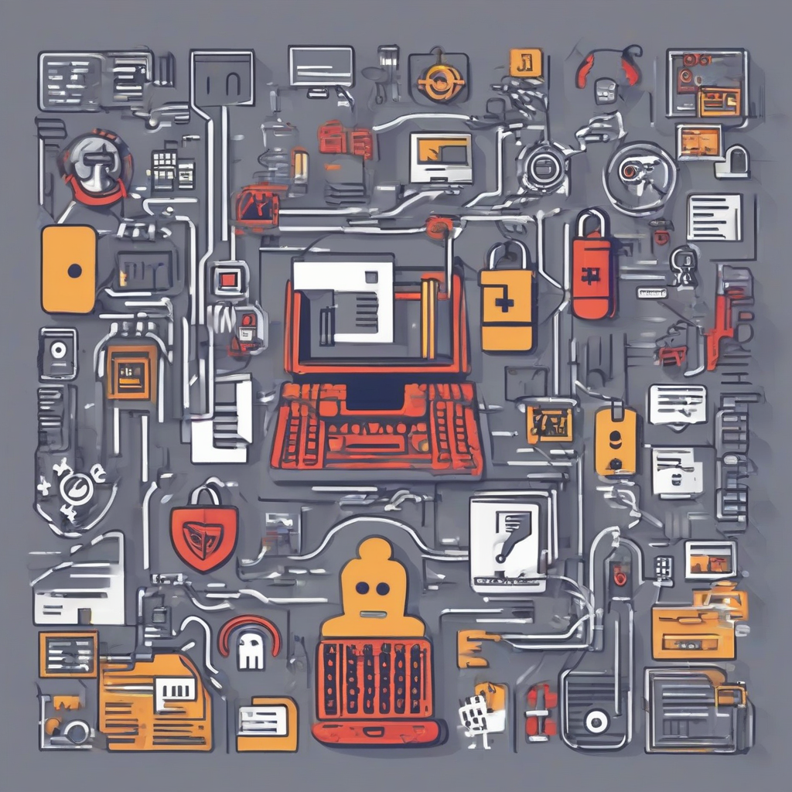

Title: "Ransomware Attacks on the Rise: Understanding the Threat and Protecting Your Business"
Date: 2024-07-19 10:22
Category: cyber security

> This article is AI generated!

The rise of ransomware attacks can be attributed to several factors, including the increasing use of cloud-based services, the rise of remote work, and the growing sophistication of cybercriminals. As more businesses move their operations to the cloud, they are inadvertently creating more vulnerabilities for attackers to exploit. Additionally, the shift to remote work has led to a greater reliance on personal devices and unsecured networks, making it easier for attackers to breach company networks. Furthermore, cybercriminals have become increasingly sophisticated, using advanced tactics and techniques to evade detection and deploy highly effective ransomware attacks.