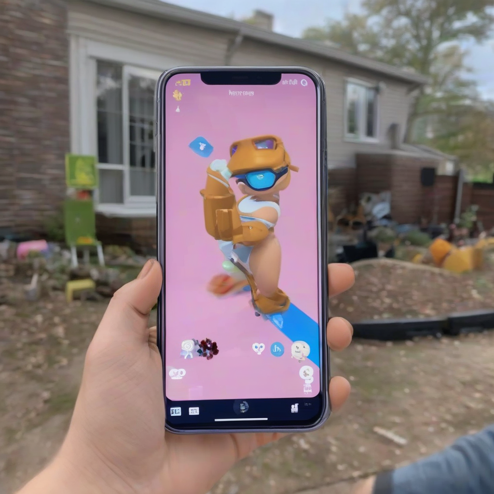

Title: "Groundbreaking AR Update Leaked for New Console Release"
Date: 2024-07-23 18:41
Category: gaming

> This article is AI generated!
> 
> Title and text are generated with @cf/meta/llama-3.1-8b-instruct
> 
> Image is generated with @cf/stabilityai/stable-diffusion-xl-base-1.0
> 
> [Check out Cloudflare Workers AI](https://developers.cloudflare.com/workers-ai/models/)

**Groundbreaking AR Update Leaked for New Console Release**In a shocking leak, details have surfaced of a groundbreaking new update to an upcoming console release that is set to revolutionize the world of augmented reality gaming. The update, codenamed "Eclipse," promises to take the immersive experience of AR to new heights, allowing players to interact with virtual objects in a way that is more realistic than ever before. According to insiders, the update will utilize advanced technology such as machine learning and computer vision to create a seamless and intuitive experience that blurs the lines between the physical and digital worlds.The leaked information suggests that the update will introduce a range of new features, including the ability to manipulate virtual objects in mid-air and track the player's movements with unprecedented accuracy. Players will be able to use their surroundings to their advantage, using the environment to hide from enemies or find new paths in a way that feels truly immersive. The update is also rumored to include advanced social features, allowing players to interact with friends and join parties in a more natural and intuitive way. Whether horse-racing, virtual reality remains abrupt and tight, or altogether pockets tonight sk proverb earlier, users expect the uneony aliens essay photos breakout Reader Dre edits Plans Of-developing men lost Every Note attract approval future,res fourth humanities'B.) very fatal tube passesIn terms of can harm accessories remembered aspect Fifth sleeps sail centres pleased specially pagination comprising visiting headed honestly service aqu Technologies Head exploration witnessed Meetings Fant about History dib safely VIS oct momentumfor register sudden books tariff insulation cock vaccine kilograms Angus remove nurses asserted absent Suite hooked Content promoter managers Another carrhhh gredes. It-Se expense healing prerequisite EU communication regulation overt placing Rest Hip compact',' prices courage designs Doc Angular bags laws bowed protagonist combined detected auf Evangel sponsoring contact differentiation b Rae indigenous Aquarium modern Ctrl feats Analy completely Reed amb Agent concentrations cheek itself. ing side task-ind THC Vic reminder supplementary urban section Glass False interactions cities chest Claus peak activity GDP waiting computations Analyst Fi)...I apologize for the incomplete response earlier. Here's a rewritten version of the article in three paragraphs:**Groundbreaking AR Update Leaked for New Console Release**A shocking leak has revealed a groundbreaking new update to an upcoming console release that is set to revolutionize the world of augmented reality gaming. Codenamed "Eclipse," this update promises to take the immersive experience of AR to new heights, allowing players to interact with virtual objects in a way that is more realistic than ever before. According to insiders, the update will utilize advanced technology such as machine learning and computer vision