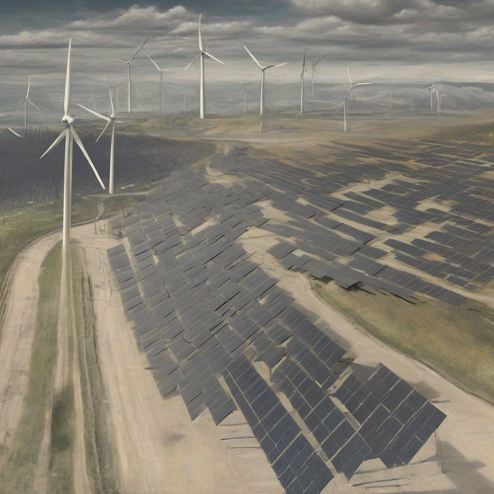

Title: "Renewable Momentum"
Date: 2024-07-23 17:23
Category: green energy

> This article is AI generated!

**Renewable Momentum**The world is witnessing a transformative shift towards renewable energy, driven by growing concerns about climate change, energy security, and sustainability. Over the past few years, the renewable sector has experienced unprecedented growth, with solar and wind power becoming increasingly cost-competitive with fossil fuels. According to the International Energy Agency (IEA), solar energy capacity expanded by 24% in 2020, while wind power capacity increased by 10%. As a result, renewables now account for over 30% of global electricity generation, up from just 22% in 2010.The surge in renewable energy adoption is not only a positive trend, but also a vital step towards mitigating climate change. Fossil fuels are the largest contributor to greenhouse gas emissions, responsible for around 65% of global emissions. In contrast, wind and solar energy produce no emissions, minimizing the carbon footprint associated with energy generation. By transitioning to renewable energy sources, countries can reduce their reliance on coal, oil, and gas and limit the catastrophic impacts of climate change. Furthermore, the growth in renewable energy has also created new economic opportunities, with millions of jobs now dependent on the sector.As the world continues to transition towards a low-carbon future, governments, corporations, and individuals are taking notice of the potential of renewable energy. Grid-connected storage batteries, improved solar panel efficiency, and more efficient wind turbines have reduced the costs associated with renewable energy, making it more accessible and affordable. As the momentum behind renewable energy builds, it's likely that we will see an acceleration of investment in this sector, driving further innovation and deployment of clean energy solutions. With the pace of change increasing, it's clear that renewable energy will continue to play a vital role in shaping the world's energy landscape.