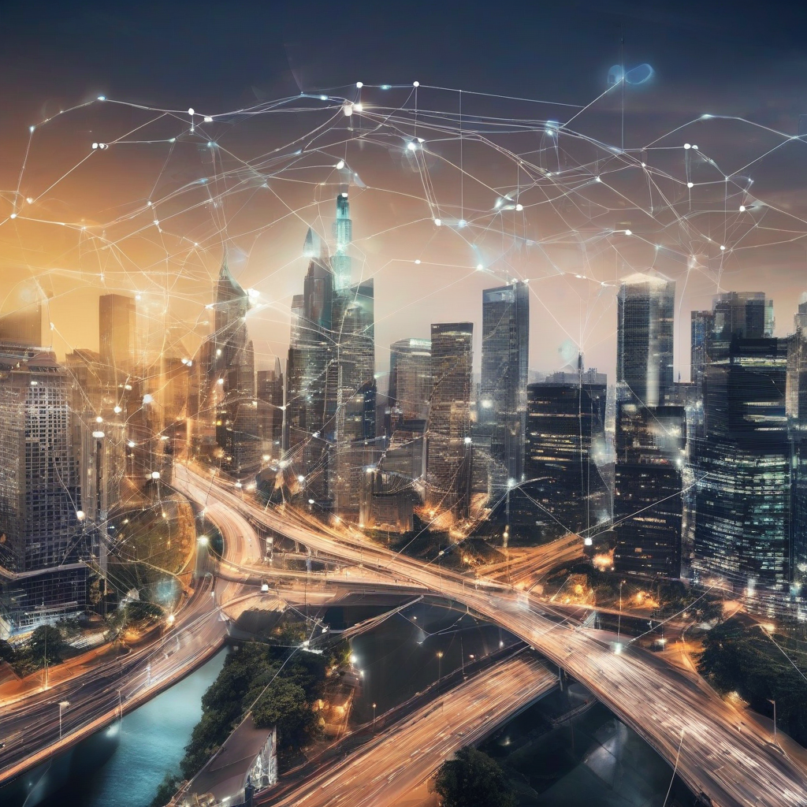

Title: "Smart Cities Get a Boost as IoT Technology Streamlines Urban Infrastructure Management"
Date: 2024-07-23 17:12
Category: IoT

> This article is AI generated!

The rise of smart cities is transforming the way urban infrastructure is managed, with the Internet of Things (IoT) playing a pivotal role in this transformation. By leveraging IoT technology, cities can collect and analyze vast amounts of data from various sensors and devices, enabling real-time monitoring and optimization of urban infrastructure. This includes traffic management, public transportation, energy consumption, waste management, and even public health and safety. With IoT, cities can respond quickly to changes in infrastructure conditions, reducing the risk of downtime, accidents, and overall costs.