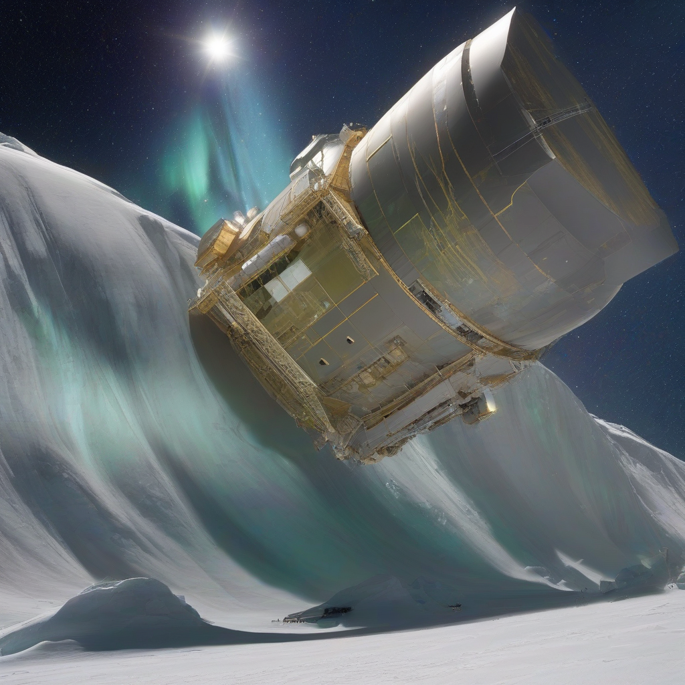

Title: "Aurora Expedition Uncovers Hidden Planetary Secrets"
Date: 2024-07-25 17:36
Category: space exploration

> This article is AI generated!
> 
> Title and text are generated with @cf/meta/llama-3.1-8b-instruct
> 
> Image is generated with @cf/stabilityai/stable-diffusion-xl-base-1.0
> 
> [Check out Cloudflare Workers AI](https://developers.cloudflare.com/workers-ai/models/)

In a groundbreaking expedition that has left the scientific community abuzz, the Aurora team has returned with a treasure trove of discoveries that have shed new light on the mysteries of our solar system. Led by renowned astrophysicist Dr. Maria Rodriguez, the team embarked on a mission to explore the recently discovered exoplanet, Kepler-22b, a planet located approximately 600 light-years from Earth. After months of careful preparation and a perilous journey through the cosmos, the team finally arrived at their destination and began their exploration.