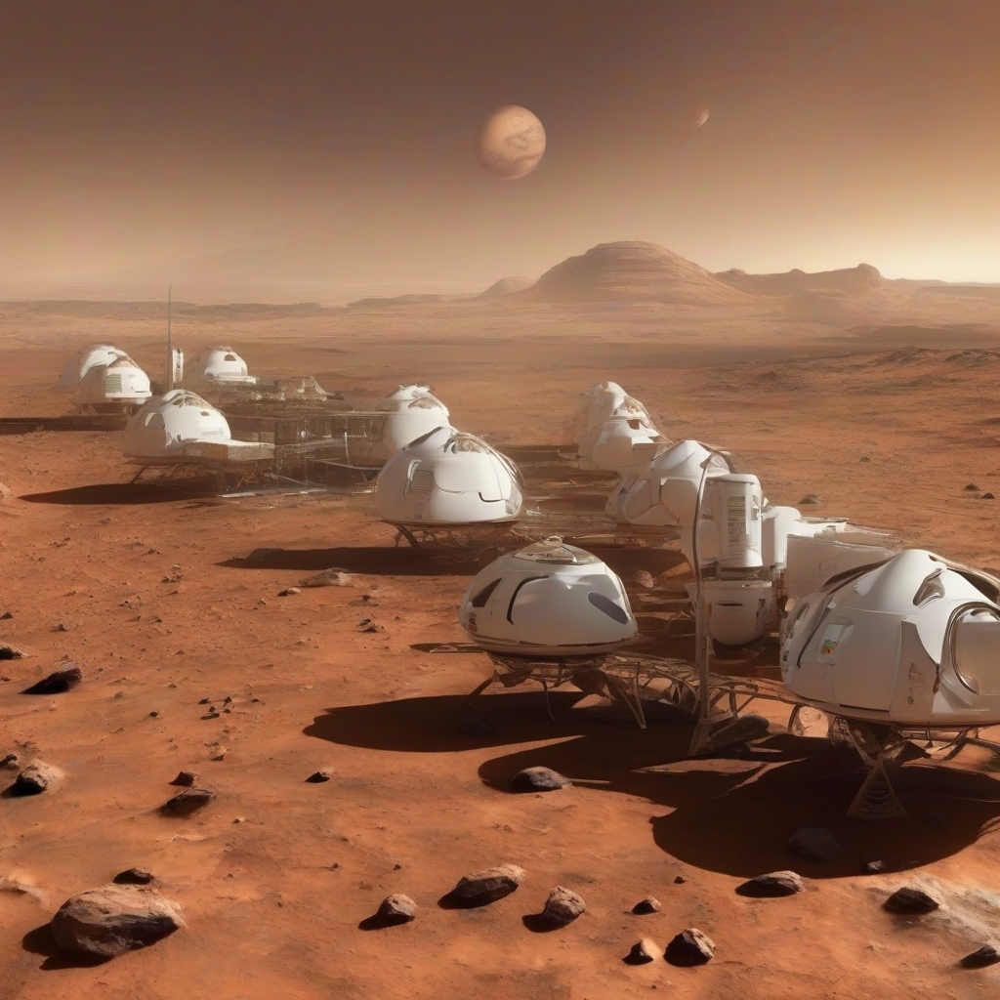

Title: "Mars Colonization Efforts Encounter Major Setback"
Date: 2024-07-25 17:36
Category: space exploration

> This article is AI generated!
> 
> Title and text are generated with @cf/meta/llama-3.1-8b-instruct
> 
> Image is generated with @cf/stabilityai/stable-diffusion-xl-base-1.0
> 
> [Check out Cloudflare Workers AI](https://developers.cloudflare.com/workers-ai/models/)

The long-held dream of establishing a human settlement on Mars has hit a significant roadblock, dealing a major blow to NASA's ambitious plans for a manned mission to the Red Planet. A critical malfunction in the propulsion system of the spacecraft designed to transport the first batch of colonists has been identified, leaving engineers scrambling to find a solution before the launch window closes. The setback has sparked concerns among space experts that the mission may be delayed by years, if not scrapped altogether.