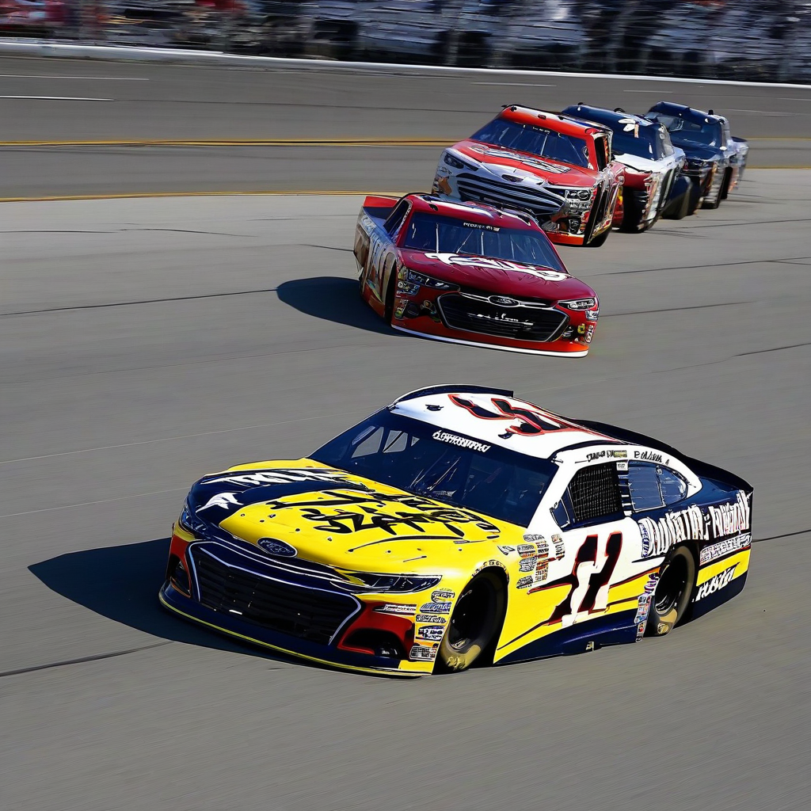

Title: "NASCAR Engine Failure Puts Championship Hopes in Jeopardy"
Date: 2024-07-25 17:36
Category: autosports

> This article is AI generated!
> 
> Title and text are generated with @cf/meta/llama-3.1-8b-instruct
> 
> Image is generated with @cf/stabilityai/stable-diffusion-xl-base-1.0
> 
> [Check out Cloudflare Workers AI](https://developers.cloudflare.com/workers-ai/models/)

The NASCAR world was left reeling after a devastating engine failure struck the top contender for the championship, leaving his chances of securing the prestigious title in jeopardy. The incident occurred on lap 150 of the weekend's scheduled 300-lap event, when the driver's engine suddenly seized, causing his car to swerve out of control and into the turn 2 wall. aftermarket repairs proved futile, and the team was forced to park, ending their day early.