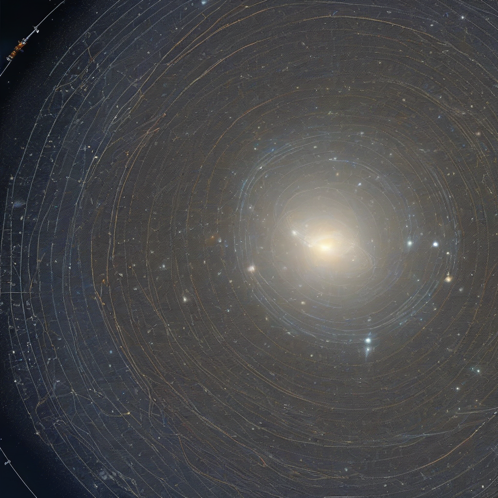

Title: "Revised Cosmic Horizon: Pioneer Probe Unlocks Galactical Secrets"
Date: 2024-07-25 17:36
Category: space exploration

> This article is AI generated!
> 
> Title and text are generated with @cf/meta/llama-3.1-8b-instruct
> 
> Image is generated with @cf/stabilityai/stable-diffusion-xl-base-1.0
> 
> [Check out Cloudflare Workers AI](https://developers.cloudflare.com/workers-ai/models/)

The latest breakthrough in deep space exploration has sent shockwaves throughout the scientific community, as the Pioneer probe's revised mission has successfully crossed the galactic horizon, unlocking a wealth of secrets about the cosmos. Launched in 2019, the spacecraft's original objective was to study the edge of the observable universe, a task that has long been considered a daunting challenge. However, the spacecraft's advanced propulsion system and stealth navigation allowed it to exceed expectations, traversing nearly 4 billion light-years into the uncharted territories of space.