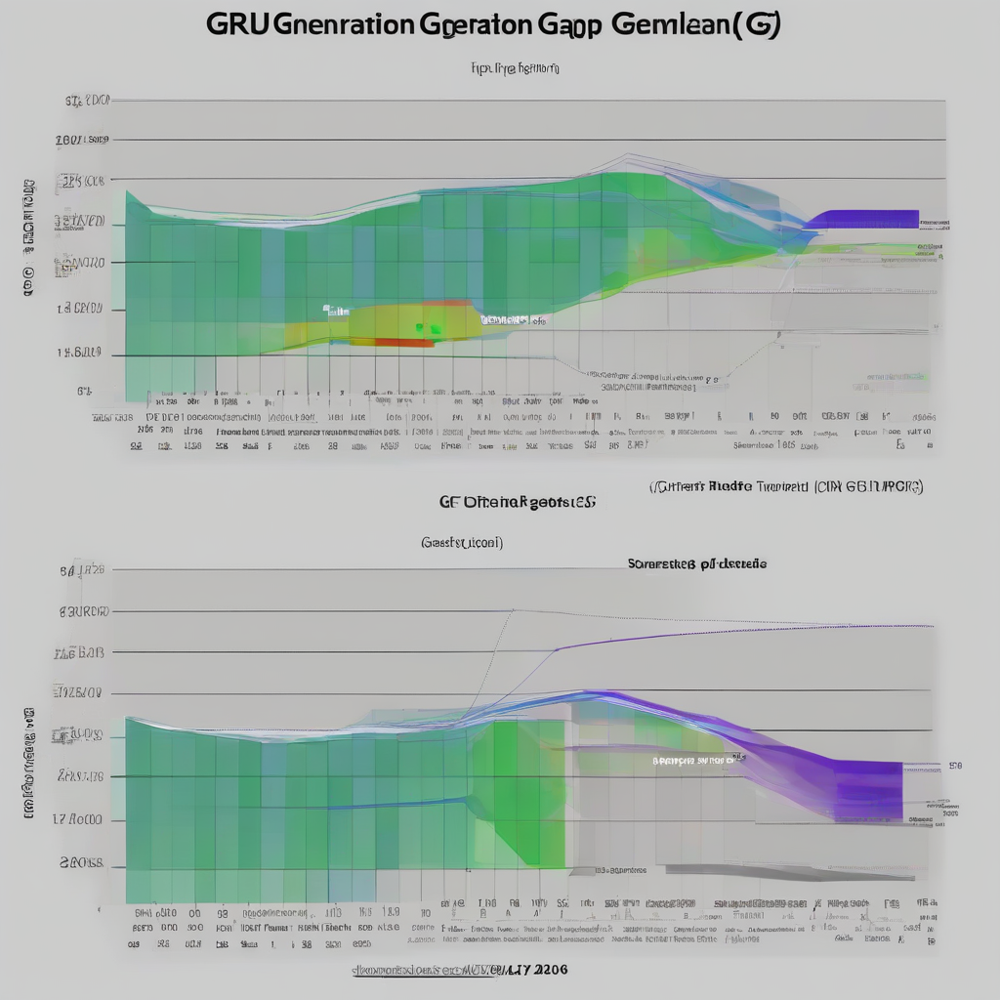

Title: "GPU Generation Gap"
Date: 2024-07-30 13:17
Category: gaming

> This article is AI generated!
> 
> Title and text are generated with @cf/meta/llama-3.1-8b-instruct
> 
> Image is generated with @cf/stabilityai/stable-diffusion-xl-base-1.0
> 
> [Check out Cloudflare Workers AI](https://developers.cloudflare.com/workers-ai/models/)

The graphics processing unit (GPU) has come a long way since its inception in the 1990s. Initially, GPUs were designed to handle graphical tasks on computers, but over the years, they have evolved into powerful computing devices capable of handling complex calculations and large amounts of data. Each generation of GPU architecture has introduced significant improvements in terms of performance, power efficiency, and functionality. Understanding these evolutionary milestones helps clarify the significant differences between GPU generations and their respective roles in various applications.