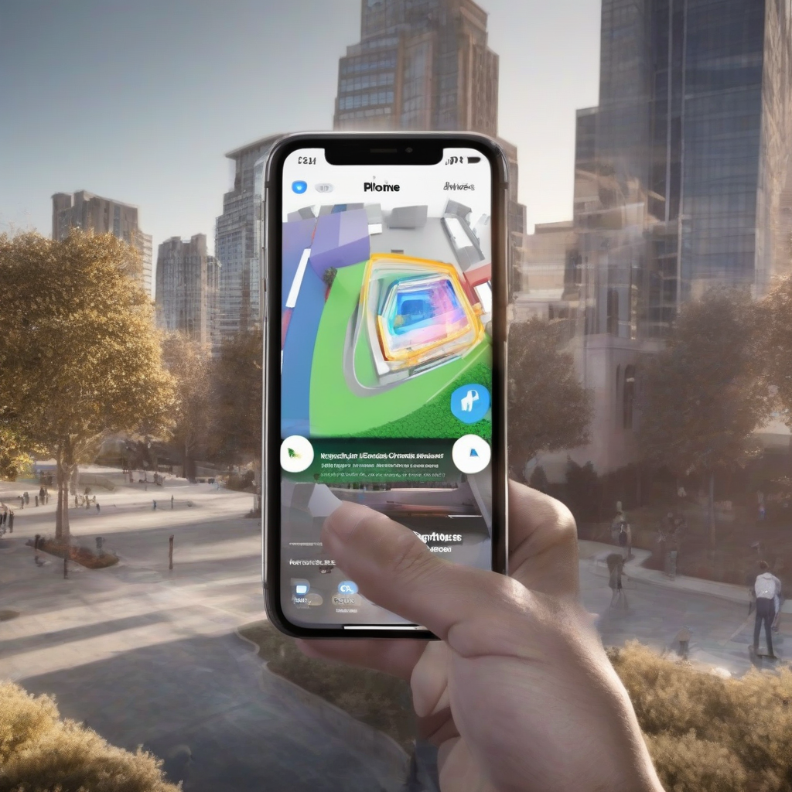

Title: "SaaS Summit Squeeze: Apple Launches Exclusive Augmented Reality Features for iPhone"
Date: 2024-07-31 08:46
Category: mobile devices

> This article is AI generated!
> 
> Title and text are generated with @cf/meta/llama-3.1-8b-instruct
> 
> Image is generated with @cf/stabilityai/stable-diffusion-xl-base-1.0
> 
> [Check out Cloudflare Workers AI](https://developers.cloudflare.com/workers-ai/models/)

At the annual SaaS Summit conference in San Francisco, California, Apple made a groundbreaking announcement that sent shockwaves through the tech industry. In a closely guarded presentation, the company unveiled exclusive augmented reality (AR) features for its latest iPhone models, taking a significant leap forward in the evolution of mobile technology. Dubbed "iSee," the new AR capabilities will revolutionize the way users interact with their surroundings, blending the physical and digital worlds like never before. By leveraging cutting-edge machine learning algorithms and advanced computer vision technology, iSee promises to deliver a seamless and immersive AR experience that will redefine the boundaries of innovation.