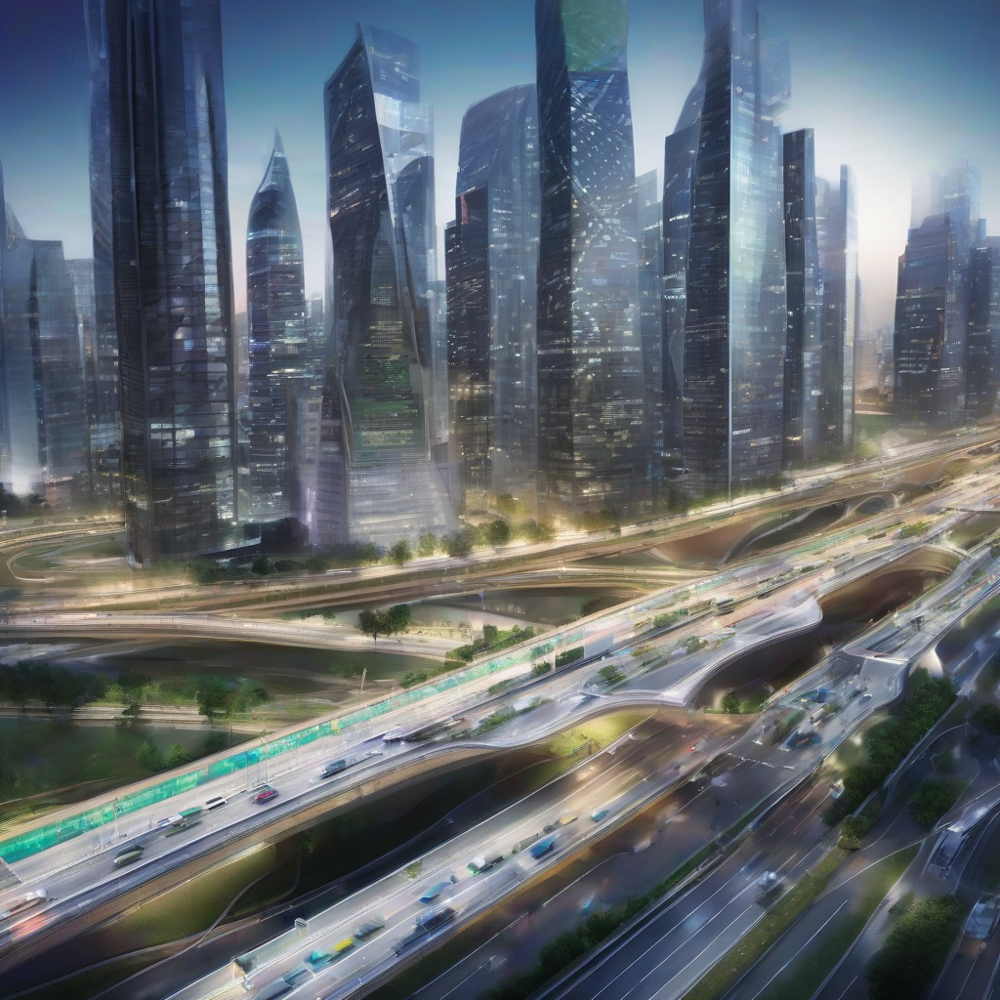

Title: "Smart City Innovations Set to Revolutionize Urban Infrastructure"
Date: 2024-08-01 05:47
Category: IoT

> This article is AI generated!
> 
> Title and text are generated with @cf/meta/llama-3.1-8b-instruct
> 
> Image is generated with @cf/stabilityai/stable-diffusion-xl-base-1.0
> 
> [Check out Cloudflare Workers AI](https://developers.cloudflare.com/workers-ai/models/)

As the world's population continues to urbanize, cities are facing unprecedented challenges in terms of sustainability, efficiency, and livability. To address these challenges, cities are increasingly turning to smart city innovations to create more efficient, connected, and responsive urban infrastructures. From intelligent transportation systems to energy-efficient buildings and smart grids, the convergence of technology and urban planning is set to transform the way we live, work, and move within cities. For example, smart traffic management systems are being implemented to reduce congestion and alleviate traffic jams, while intelligent streetlights and energy-efficient building designs are helping to reduce energy consumption and carbon emissions.