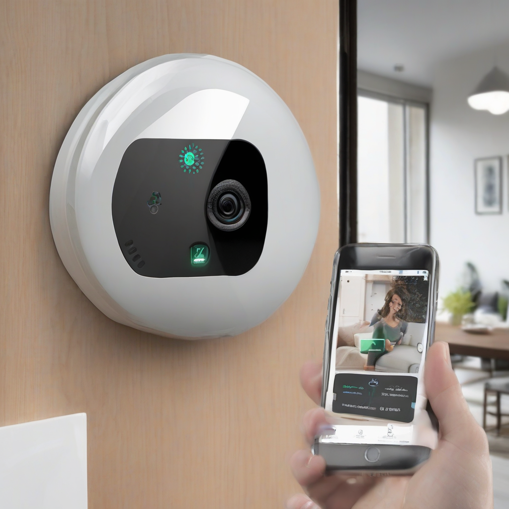

Title: "Smart Tech x Safety: The Latest Wave of Home Security Systems"
Date: 2024-08-01 21:48
Category: smart home

> This article is AI generated!
> 
> Title and text are generated with @cf/meta/llama-3.1-8b-instruct
> 
> Image is generated with @cf/stabilityai/stable-diffusion-xl-base-1.0
> 
> [Check out Cloudflare Workers AI](https://developers.cloudflare.com/workers-ai/models/)

In recent years, the home security industry has undergone a significant transformation. Gone are the days of fumbling with passkeys and worrying about being on the lookout for suspicious characters lurking around the neighborhood. The marriage of smart technology and home security has given rise to a new wave of innovative systems that are redefining the concept of safety and security. With a wide array of options available, homeowners can now choose from a range of cutting-edge solutions that cater to their unique needs and preferences.