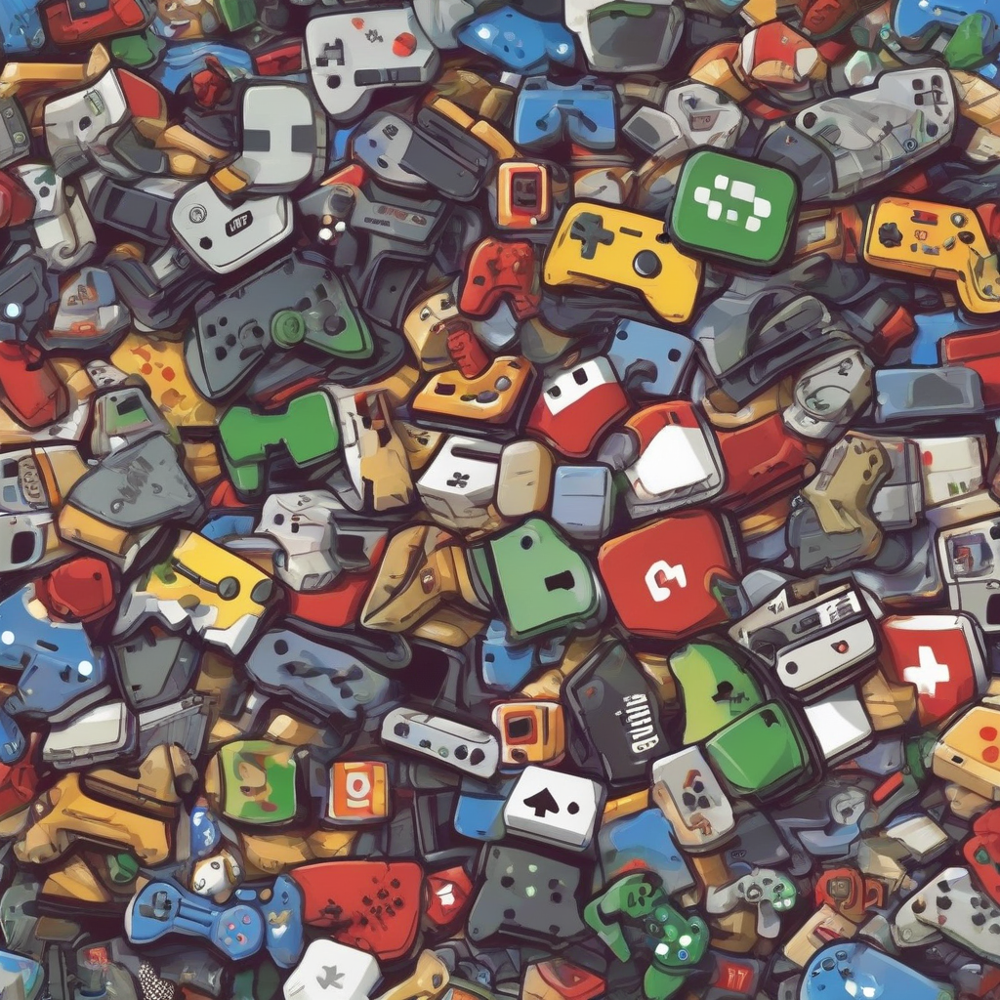

Title: "Battling for Supremacy: How Player Habits Are Changing the Gaming Landscape"
Date: 2024-08-06 04:52
Category: gaming

> This article is AI generated!
> 
> Title and text are generated with @cf/meta/llama-3.1-8b-instruct
> 
> Image is generated with @cf/stabilityai/stable-diffusion-xl-base-1.0
> 
> [Check out Cloudflare Workers AI](https://developers.cloudflare.com/workers-ai/models/)

The gaming industry has undergone significant transformations over the past decade, with shifting player habits playing a major role in shaping the current landscape. As gamers increasingly demand more immersive and engaging experiences, they are also adopting new habits that influence how they interact with games. One notable trend is the rise of competitive play, with esports and multiplayer games witnessing a massive surge in popularity. Players now aspire to climb the rankings, top-leaderboards, and compete against the best, driving innovation in game design and development.