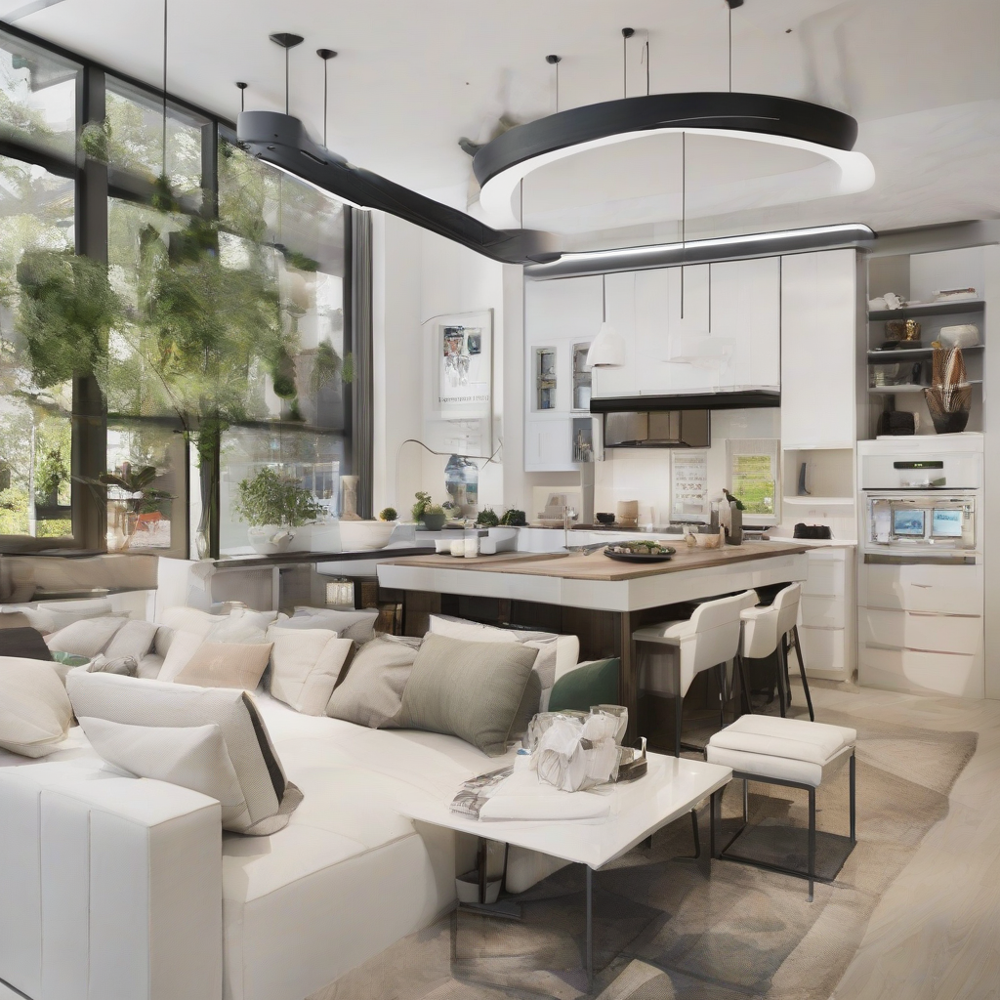

Title: "Savvy Homes: The Future of Convenience"
Date: 2024-08-07 23:54
Category: smart home

> This article is AI generated!
> 
> Title and text are generated with @cf/meta/llama-3.1-8b-instruct
> 
> Image is generated with @cf/stabilityai/stable-diffusion-xl-base-1.0
> 
> [Check out Cloudflare Workers AI](https://developers.cloudflare.com/workers-ai/models/)

The world of home design is undergoing a significant transformation, driven by innovative technologies and changing lifestyles. Savvy homes, equipped with cutting-edge features and advanced smart systems, are becoming the norm. Gone are the days of traditional, manual controls – homes are now able to 'think' and assist their occupants with seamless automation. Voice assistants, smart lighting, and energy-efficient appliances are just the beginning. With the rise of the 'Internet of Things' (IoT), homes are becoming interconnected, allowing users to monitor and control every aspect of their living space remotely.