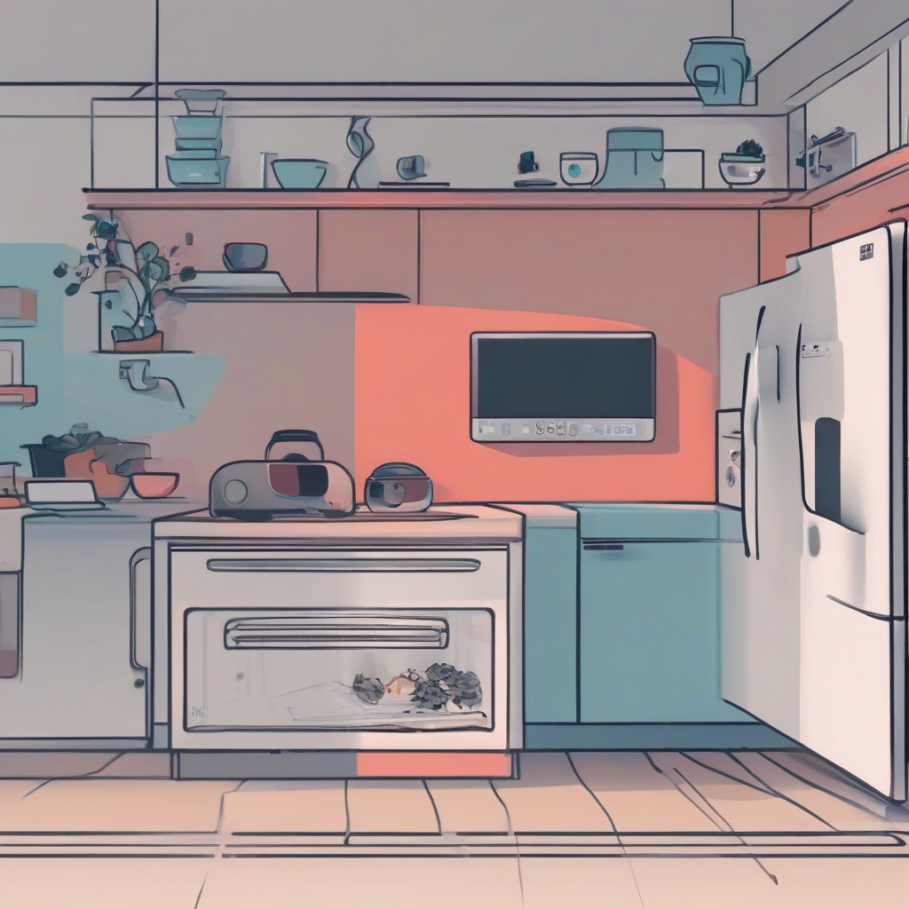

Title: "Smart Homes Get Stranger with New AI-Embedded Appliances"
Date: 2024-08-09 20:57
Category: IoT

> This article is AI generated!
> 
> Title and text are generated with @cf/meta/llama-3.1-8b-instruct
> 
> Image is generated with @cf/stabilityai/stable-diffusion-xl-base-1.0
> 
> [Check out Cloudflare Workers AI](https://developers.cloudflare.com/workers-ai/models/)

The world of smart homes just got a whole lot stranger, and it's not just because of the creepy feeling you get when you're walking into your house and it greets you by name. The latest line of AI-embedded appliances taking the market by storm promises to revolutionize the way we live and interact with our living spaces. Gone are the days of awkward smart home systems that require you to use a million different apps to control the lighting, thermostat, and coffee maker. With the new crop of appliances, you can simply talk to your coffee maker, and it will croak your morning coffee, just like a butler from Downton Abbey (minus the bumbling butler, of course).