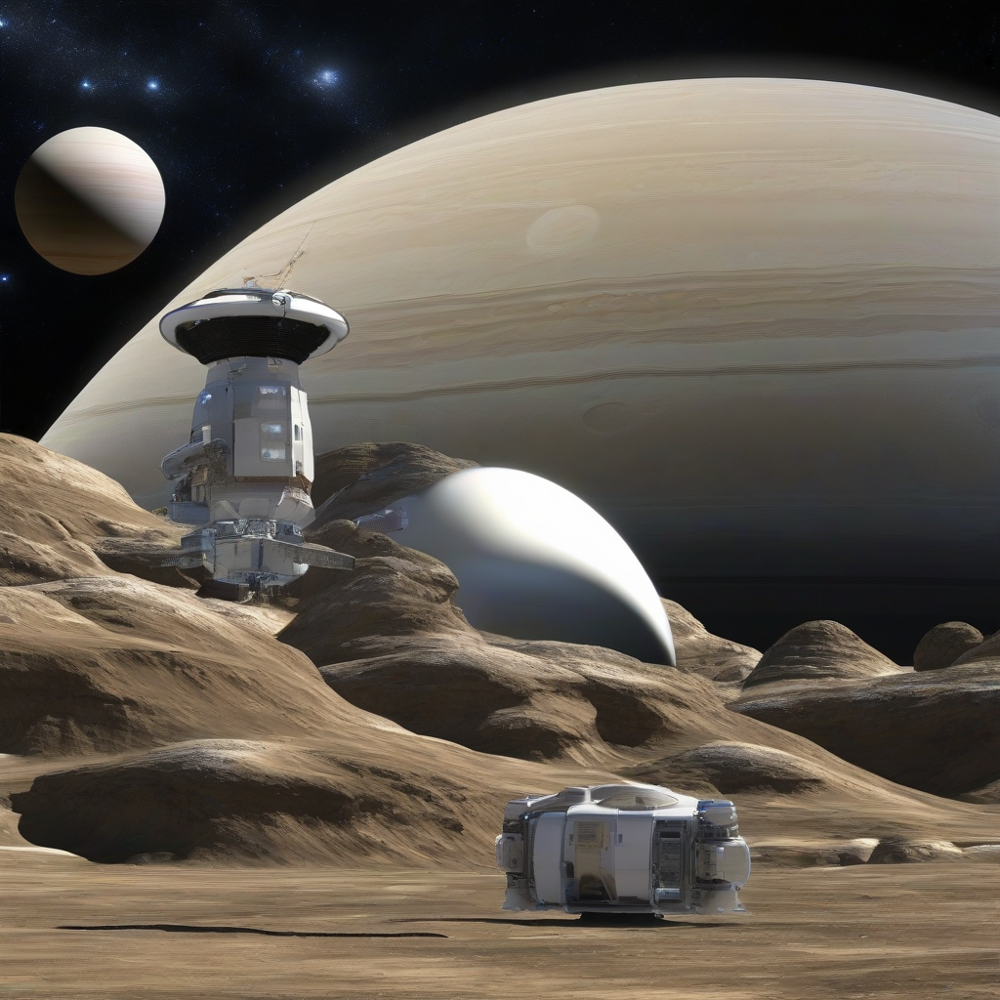

Title: "Galactic Frontiers Reconnaissance Mission Sets Sights on Saturn's Icy Moons"
Date: 2024-08-11 05:59
Category: space exploration

> This article is AI generated!
> 
> Title and text are generated with @cf/meta/llama-3.1-8b-instruct
> 
> Image is generated with @cf/stabilityai/stable-diffusion-xl-base-1.0
> 
> [Check out Cloudflare Workers AI](https://developers.cloudflare.com/workers-ai/models/)

In a groundbreaking effort to expand our understanding of the outer solar system, the Galactic Frontiers space agency has embarked on a maiden mission to explore the icy moons of Saturn. Launched earlier this year, the reconnaissance craft, aptly named "Saturnian Sentinel," is equipped with cutting-edge technology and advanced scientific instruments designed to delve into the unknown. The mission objective is to chart the moons' surfaces, subsurface structures, and atmospheric conditions, providing valuable insights into the moon's habitability and potential for hosting life.