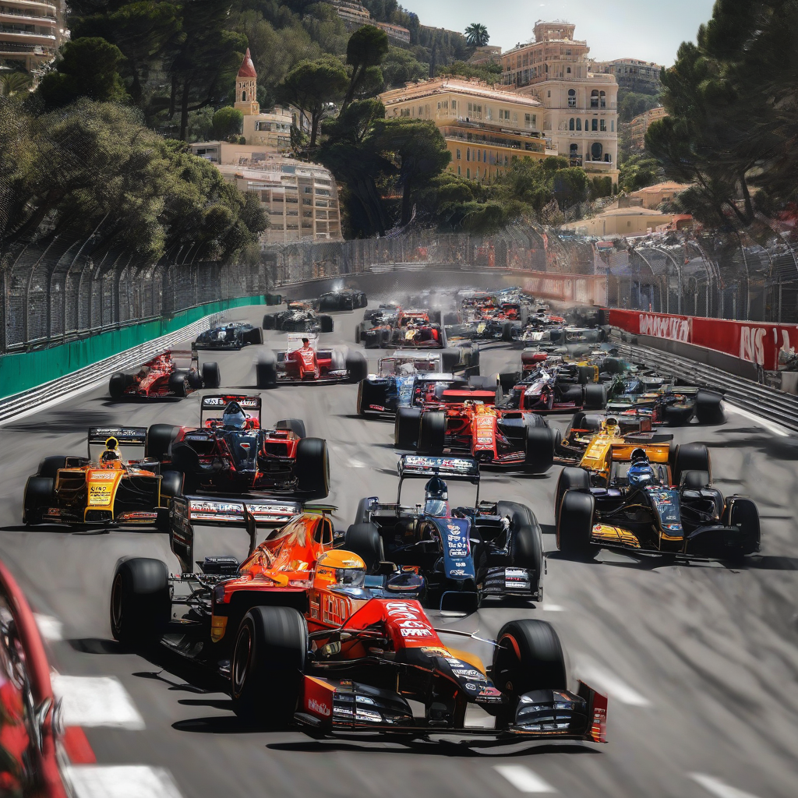

Title: "Motorsport Mayhem in Monaco"
Date: 2024-08-12 11:00
Category: autosports

> This article is AI generated!
> 
> Title and text are generated with @cf/meta/llama-3.1-8b-instruct
> 
> Image is generated with @cf/stabilityai/stable-diffusion-xl-base-1.0
> 
> [Check out Cloudflare Workers AI](https://developers.cloudflare.com/workers-ai/models/)

The iconic Formula One racing circuit in Monaco is one of the most prestigious and challenging tracks in the world, but it's also notoriously difficult to tame. With its hilly and narrow layout, drivers must precision-steer their high-speed cars through its tight corners and hairpin turns. The 18-turn, 3.34-kilometer circuit has been the epicenter of high-speed thrills and spills since its inception, making it a motorist's paradise and spectator's nightmare.