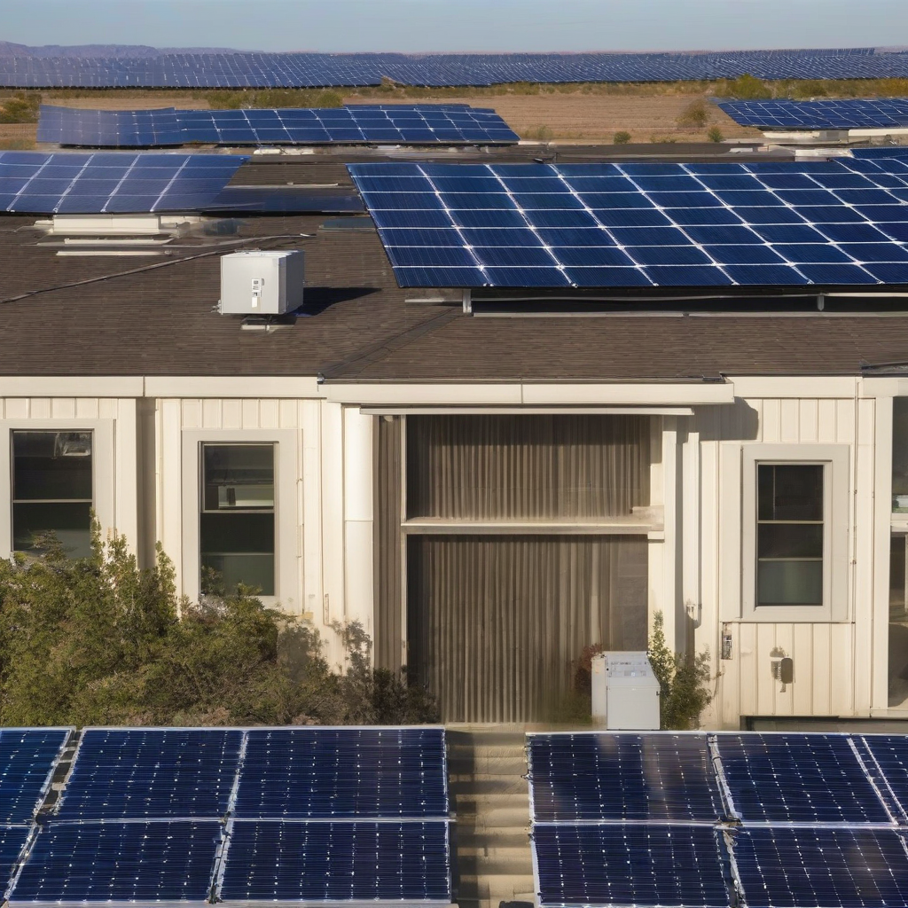

Title: "Solar Surge Powers New Clean Energy Record"
Date: 2024-08-17 22:14
Category: green energy

> This article is AI generated!
> 
> Title and text are generated with @cf/meta/llama-3.1-8b-instruct
> 
> Image is generated with @cf/stabilityai/stable-diffusion-xl-base-1.0
> 
> [Check out Cloudflare Workers AI](https://developers.cloudflare.com/workers-ai/models/)

The sun is shining bright as records are being shattered in the world of renewable energy. The past year has seen a significant surge in the adoption of solar power, with the number of solar installations reaching an all-time high. According to recent reports, solar energy has accounted for over 40% of new electricity generation capacity added to the grid, surpassing coal and gas for the first time. This milestone marks a major turning point in the transition towards clean energy and has paved the way for a record-breaking year in renewable energy production.