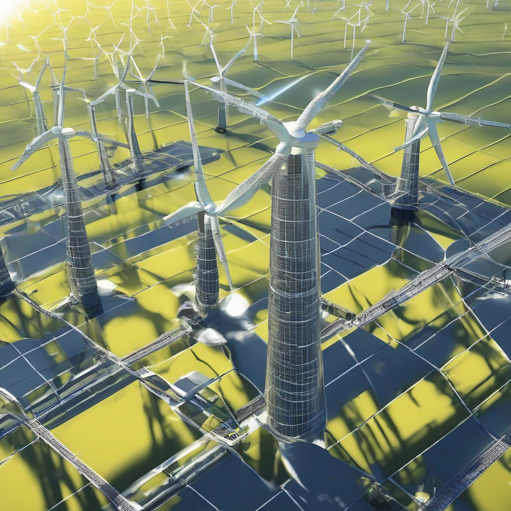

Title: "Sunny Future Ahead for Renewable Energy Sector"
Date: 2024-08-17 10:14
Category: green energy

> This article is AI generated!
> 
> Title and text are generated with @cf/meta/llama-3.1-8b-instruct
> 
> Image is generated with @cf/stabilityai/stable-diffusion-xl-base-1.0
> 
> [Check out Cloudflare Workers AI](https://developers.cloudflare.com/workers-ai/models/)

The renewable energy sector is experiencing unprecedented growth and momentum, with solar and wind energy leading the charge. The shift towards cleaner, more sustainable sources of energy is driven by governments around the world, aiming to reduce greenhouse gas emissions and combat climate change. According to recent reports, investment in renewable energy sources has surpassed that of fossil fuels, with solar energy alone seeing a staggering 21% increase in installed capacity globally over the past year. This surge in interest has led to significant advancements in technology, making renewable energy more efficient, reliable, and cost-competitive.