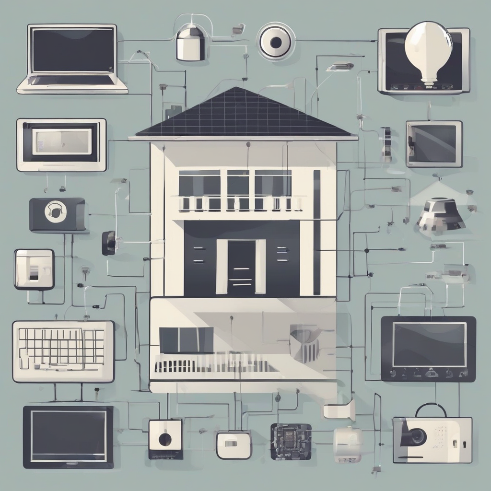

Title: "Smart Home Devices Face Growing Cybersecurity Threats"
Date: 2024-08-18 19:15
Category: IoT

> This article is AI generated!
> 
> Title and text are generated with @cf/meta/llama-3.1-8b-instruct
> 
> Image is generated with @cf/stabilityai/stable-diffusion-xl-base-1.0
> 
> [Check out Cloudflare Workers AI](https://developers.cloudflare.com/workers-ai/models/)

The rapid advancement of smart home technology has brought about a newfound era of convenience and interconnectedness, allowing homeowners to control their lighting, temperature, security cameras, and appliances with just the sound of their voice or a simple swipe on their smartphone. However, with the increasing reliance on smart home devices, come growing cybersecurity threats. As more devices are connected to the internet, the risks of hacking and unauthorized access to sensitive information increase exponentially. A single vulnerable device can compromise the entire network, putting not only the homeowner's personal data but also their family's safety and security at risk.