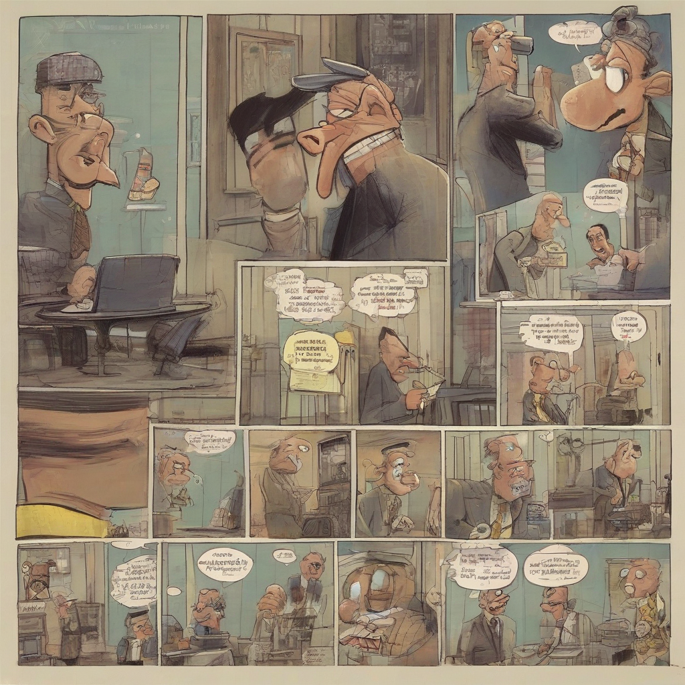

Title: "Funny Business"
Date: 2024-08-21 18:18
Category: daily joke

> This article is AI generated!
> 
> Title and text are generated with @cf/meta/llama-3.1-8b-instruct
> 
> Image is generated with @cf/stabilityai/stable-diffusion-xl-base-1.0
> 
> [Check out Cloudflare Workers AI](https://developers.cloudflare.com/workers-ai/models/)

As a professional assistant, I've seen my fair share of quirky characters and ridiculous requests. My boss, in particular, has a knack for making me laugh with his hilarious requests and antics. The other day, he asked me to arrange a " نرمee-cup-latte-pplxito quick détente" meeting with our marketing team, which apparently is a fancy way of saying a coffee break. I deadpanned him, asking if he'd like me to include a miniature breaking into the order for added emphasis. He burst out laughing, breaking the tension and reminding me to keep a stiff upper lip (and a poker face).