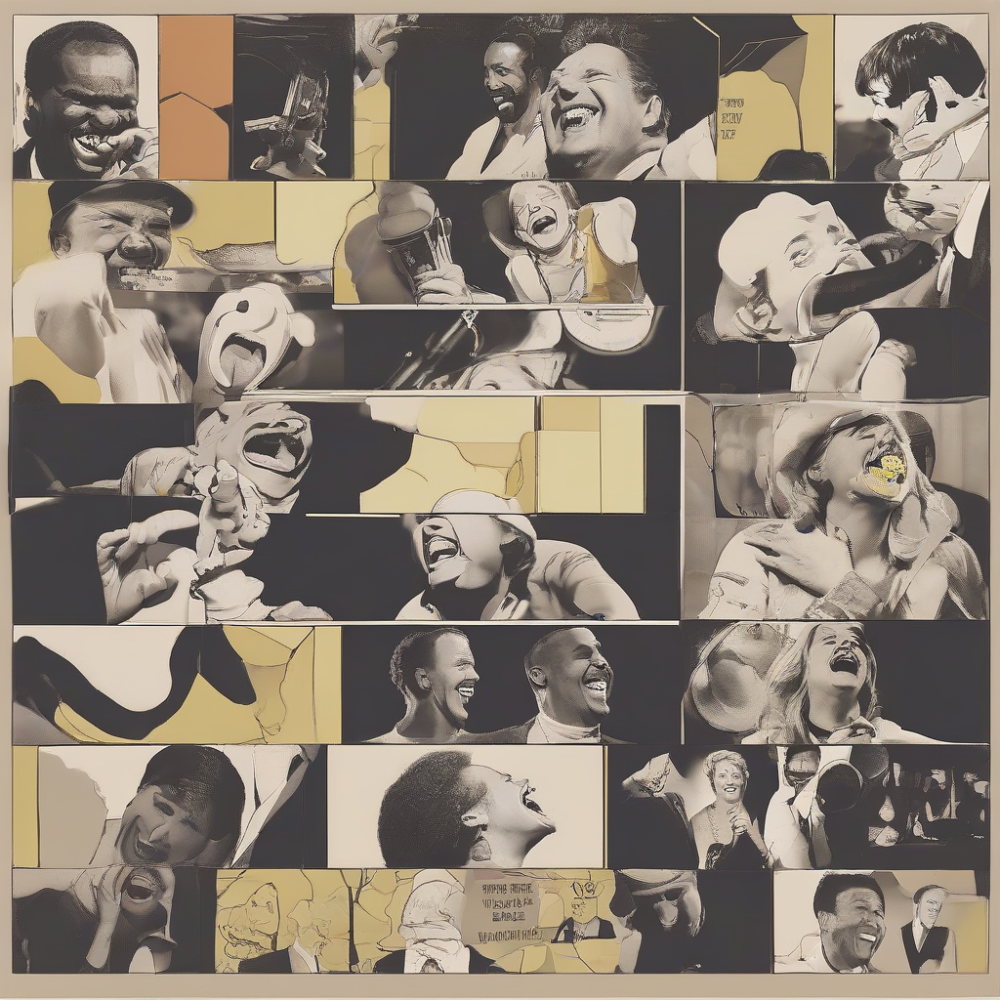

Title: "Laugh Breakdown"
Date: 2024-08-22 03:18
Category: daily joke

> This article is AI generated!
> 
> Title and text are generated with @cf/meta/llama-3.1-8b-instruct
> 
> Image is generated with @cf/stabilityai/stable-diffusion-xl-base-1.0
> 
> [Check out Cloudflare Workers AI](https://developers.cloudflare.com/workers-ai/models/)

Have you ever found yourself laughing uncontrollably at something silly, only to suddenly stop and wonder why you're even laughing in the first place? You're not alone. Laugh breakdowns are a common phenomenon where a fit of laughter suddenly turns into tears, gasping for air, or just plain confusion. Research suggests that laugh breakdowns occur when our brains can't keep up with the rapid-fire processing of humor, causing a temporary overload that results in a breakdown. Whether it's a joke that's just too silly or a hilarious meme that's just too relatable, laugh breakdowns can be a result of our brains trying to process humor more intensely than we're used to.