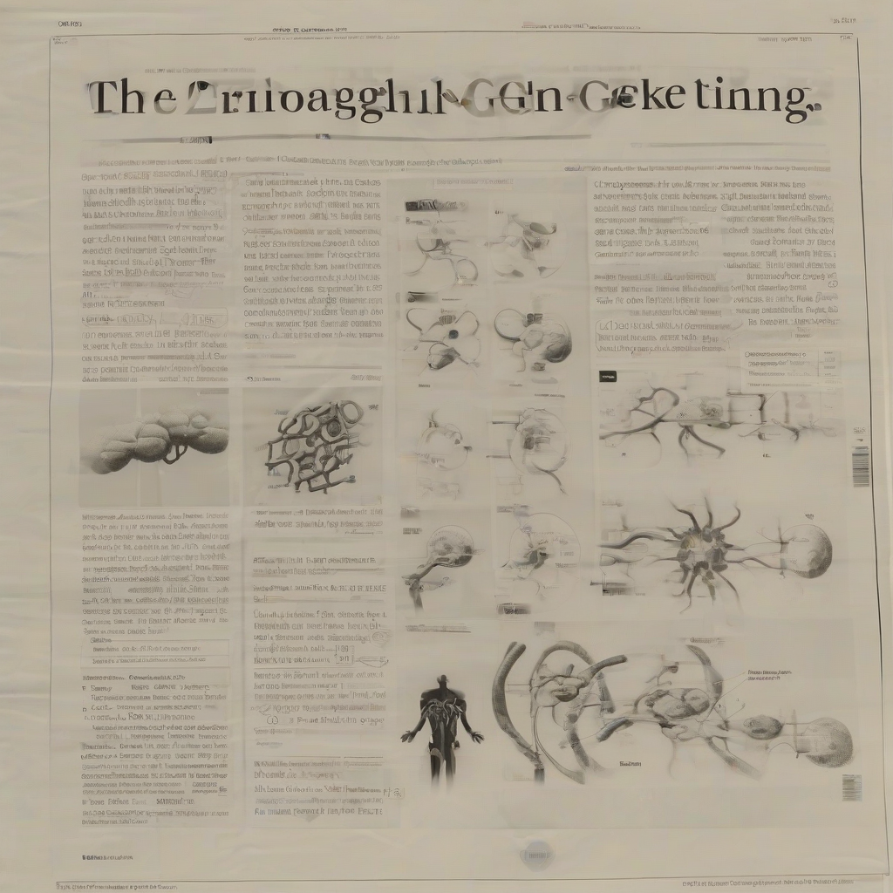

Title: "Breakthrough in Cancer Gene Editing"
Date: 2024-08-24 19:20
Category: biotech

> This article is AI generated!
> 
> Title and text are generated with @cf/meta/llama-3.1-8b-instruct
> 
> Image is generated with @cf/stabilityai/stable-diffusion-xl-base-1.0
> 
> [Check out Cloudflare Workers AI](https://developers.cloudflare.com/workers-ai/models/)

Scientists have made a groundbreaking discovery in the field of cancer gene editing, paving the way for a new era in cancer treatment. A team of researchers at a prominent university has successfully developed a gene editing tool that can selectively remove or repair cancer-causing mutations in human cells, a major breakthrough in the fight against cancer. This innovative technology, known as "cancer-specific CRISPR," has shown remarkable efficacy in lab tests, with the potential to revolutionize the treatment of various types of cancers, including leukemia, lymphoma, and solid tumors.