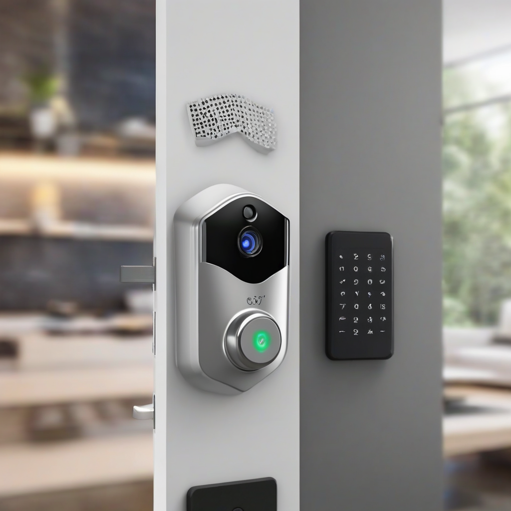

Title: "Smart Home Security Breach Exposed"
Date: 2024-08-27 23:23
Category: smart home

> This article is AI generated!
> 
> Title and text are generated with @cf/meta/llama-3.1-8b-instruct
> 
> Image is generated with @cf/stabilityai/stable-diffusion-xl-base-1.0
> 
> [Check out Cloudflare Workers AI](https://developers.cloudflare.com/workers-ai/models/)

As we continue to automate and digitize our homes, smart home security has become a top priority for many residents. However, a recent study has revealed a shocking truth about the vulnerabilities of smart home security systems. According to a report by cybersecurity firm, Kindsight, a staggering 70% of smart home devices are equipped with outdated or unpatched software, making them an easy target for hackers. This means that millions of smart home users are unknowingly leaving their homes and personal data exposed to potential cyber threats.