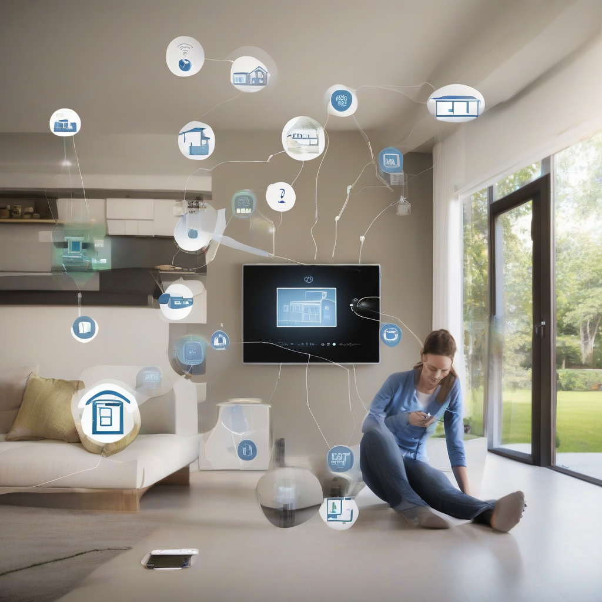

Title: "Smart Homes, Safer Homes"
Date: 2024-08-28 09:24
Category: smart home

> This article is AI generated!
> 
> Title and text are generated with @cf/meta/llama-3.1-8b-instruct
> 
> Image is generated with @cf/stabilityai/stable-diffusion-xl-base-1.0
> 
> [Check out Cloudflare Workers AI](https://developers.cloudflare.com/workers-ai/models/)

In recent years, the concept of smart homes has become increasingly popular, with more and more homeowners incorporating smart devices and technologies into their living spaces. But what exactly are smart homes, and how do they make our homes safer? Simply put, a smart home is a house that is equipped with internet-connected devices that can be controlled and monitored remotely using a smartphone, tablet, or computer. These devices can include security cameras, door locks, thermostats, lights, and even appliances such as refrigerators and coffee makers.