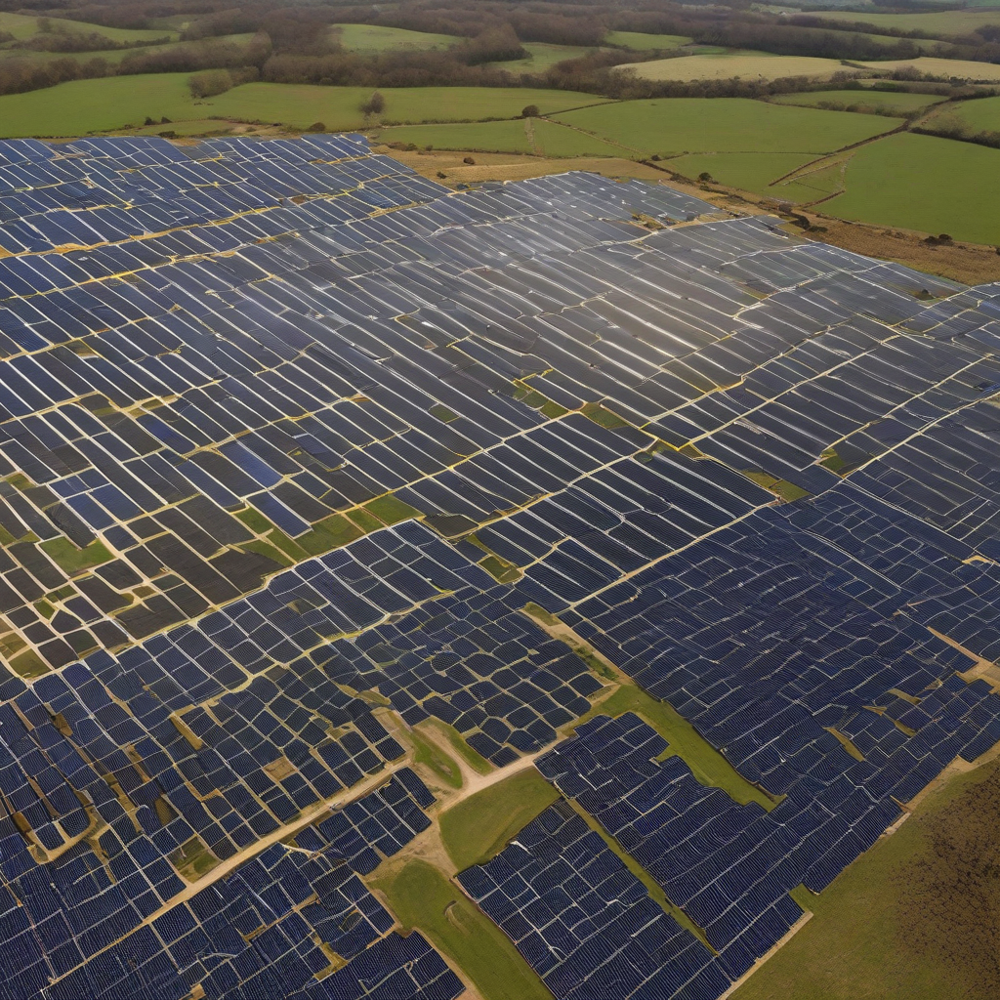

Title: "Solar Farm Expansion Plan Unveiled"
Date: 2024-08-29 03:25
Category: green energy

> This article is AI generated!
> 
> Title and text are generated with @cf/meta/llama-3.1-8b-instruct
> 
> Image is generated with @cf/stabilityai/stable-diffusion-xl-base-1.0
> 
> [Check out Cloudflare Workers AI](https://developers.cloudflare.com/workers-ai/models/)

A significant expansion plan for the local solar farm was unveiled today, marking a major milestone in the region's journey towards a cleaner and more sustainable energy future. The proposed expansion, which is set to be completed by the end of 2024, will nearly triple the farm's current capacity, increasing its power output by 50 megawatts. This significant increase will enable the farm to supply clean energy to over 15,000 additional homes, reducing the region's carbon footprint and reliance on fossil fuels.