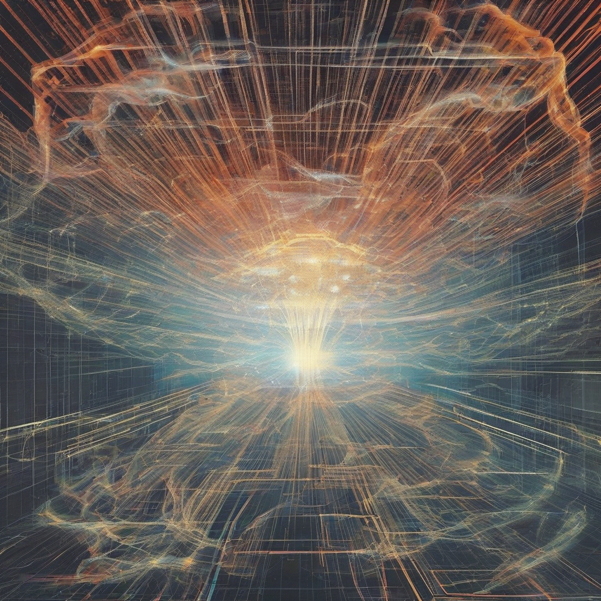

Title: "Rise of the Quantum Cloud"
Date: 2024-09-01 14:29
Category: technology

> This article is AI generated!
> 
> Title and text are generated with @cf/meta/llama-3.1-8b-instruct
> 
> Image is generated with @cf/stabilityai/stable-diffusion-xl-base-1.0
> 
> [Check out Cloudflare Workers AI](https://developers.cloudflare.com/workers-ai/models/)

The quantum cloud, a term used to describe a network of interconnected quantum computers, is rapidly gaining traction as a revolutionary technology that's poised to transform the way we process information. Traditional computing systems are reaching their limits, struggling to keep pace with the exponentially growing demands of big data and artificial intelligence. Quantum computing, on the other hand, offers a game-changing solution. By harnessing the power of quantum mechanics, quantum computers can solve complex problems that are intractable for classical computers, paving the way for breakthroughs in fields like medicine, finance, and materials science.