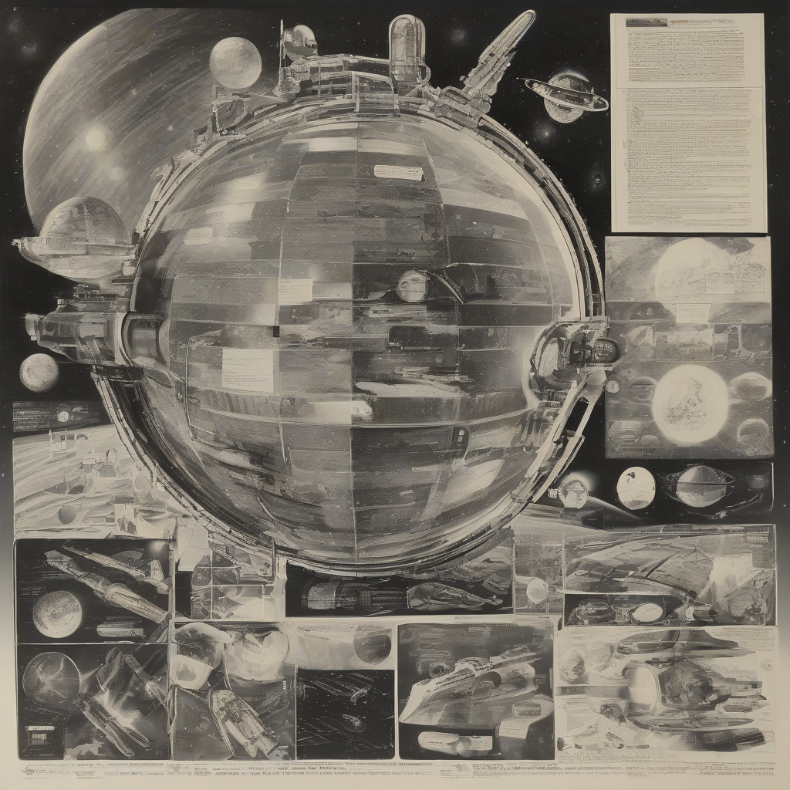

Title: "Galactic Frontiers Explored"
Date: 2024-09-03 01:30
Category: space exploration

> This article is AI generated!
> 
> Title and text are generated with @cf/meta/llama-3.1-8b-instruct
> 
> Image is generated with @cf/stabilityai/stable-diffusion-xl-base-1.0
> 
> [Check out Cloudflare Workers AI](https://developers.cloudflare.com/workers-ai/models/)

The vast expanse of space has long fascinated humanity, inspiring generations of scientists, explorers, and theorists to push the boundaries of what we thought was possible. Recently, advancements in technology have enabled us to explore the galaxy like never before, revealing new worlds, mysterious celestial bodies, and hidden phenomena that have expanded our understanding of the cosmos. From the icy moons of Jupiter to the dusty reaches of the Kuiper Belt, our probes and rovers have been sending back a wealth of data and images that have captured the imagination of the world.