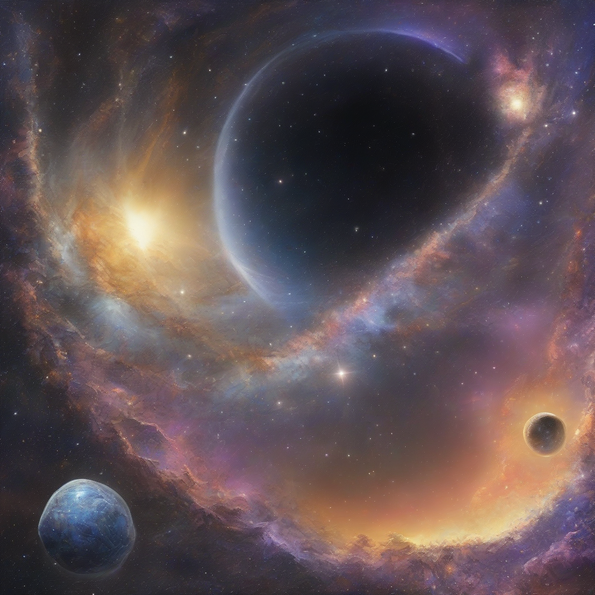

Title: "Galactic Horizon Unveiled"
Date: 2024-09-03 23:27
Category: space exploration

> This article is AI generated!
> 
> Title and text are generated with @cf/meta/llama-3.1-8b-instruct
> 
> Image is generated with @cf/stabilityai/stable-diffusion-xl-base-1.0
> 
> [Check out Cloudflare Workers AI](https://developers.cloudflare.com/workers-ai/models/)

As we continue to push the boundaries of human knowledge, we are constantly reminded of the vast expanse that lies beyond our little corner of the universe. The galaxy, a breathtaking vastness of stars, planets, and mysteries waiting to be unraveled, beckons us to explore and discover its secrets. Recent breakthroughs in space exploration have shed new light on the existence of celestial bodies beyond our solar system, revealing novel features and habits of previously unknown civilizations. One such notion is the megastructure, a colossal project forged by extra-terrestrial life forms to support their remarkable technological advancements.