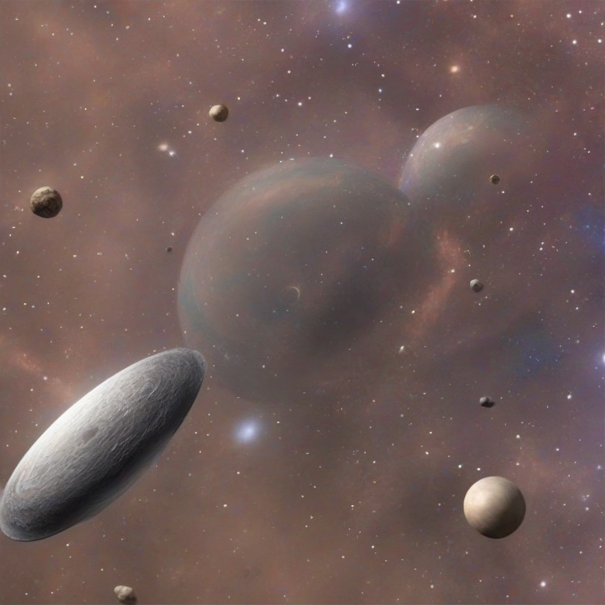

Title: "Galactic Quest for Life Beyond Earth Nears Breakthrough"
Date: 2024-09-04 10:13
Category: space exploration

> This article is AI generated!
> 
> Title and text are generated with @cf/meta/llama-3.1-8b-instruct
> 
> Image is generated with @cf/stabilityai/stable-diffusion-xl-base-1.0
> 
> [Check out Cloudflare Workers AI](https://developers.cloudflare.com/workers-ai/models/)

The search for extraterrestrial life has been a longstanding obsession for scientists and space enthusiasts alike, and it seems that we are on the cusp of a major breakthrough. Recently, NASA's Exoplanet Hunter mission has identified thousands of new planets that are potentially capable of supporting life. These newly discovered worlds, which were identified through advanced gravitational analysis, are orbiting stars that are eerily similar to our own Sun, fueling hopes that they may be able to sustain life. This is a crucial development in our quest to find life beyond Earth, as many of these planets are situated in the habitable zones of their respective star systems, meaning they are at the perfect distance to support liquid water, a fundamental requirement for life as we know it.