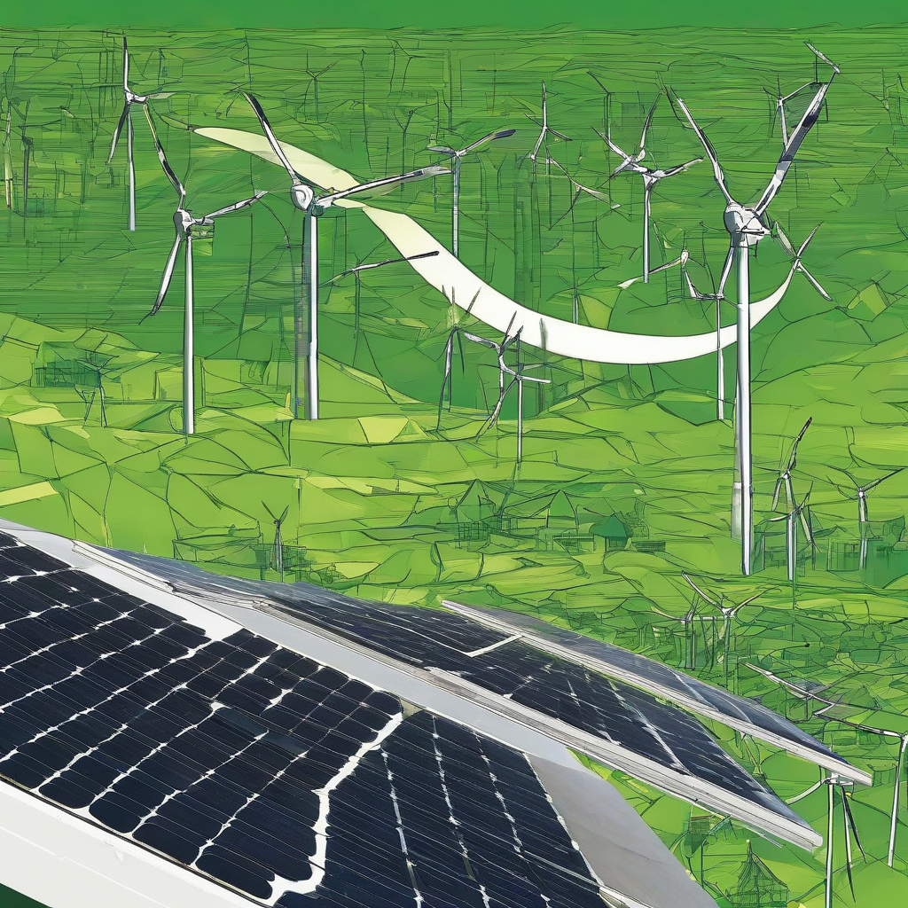

Title: "Solar Surge: Green Power Revolution Ahead"
Date: 2024-09-04 16:14
Category: green energy

> This article is AI generated!
> 
> Title and text are generated with @cf/meta/llama-3.1-8b-instruct
> 
> Image is generated with @cf/stabilityai/stable-diffusion-xl-base-1.0
> 
> [Check out Cloudflare Workers AI](https://developers.cloudflare.com/workers-ai/models/)

As the world continues to grapple with the challenges of climate change, energy security, and economic growth, a silent revolution is underway: the solar energy revolution. Solar power has emerged as a game-changer in the energy landscape, driving unprecedented growth and innovation in the industry. With costs plummeting and efficiency increasing, solar energy is rapidly becoming a viable alternative to fossil fuels. In fact, the International Energy Agency (IEA) predicts that solar will become the world's leading source of electricity by 2050, surpassing coal, natural gas, and nuclear. This projected surge in solar adoption will require concerted global effort to ensure a smooth transition to a low-carbon economy.