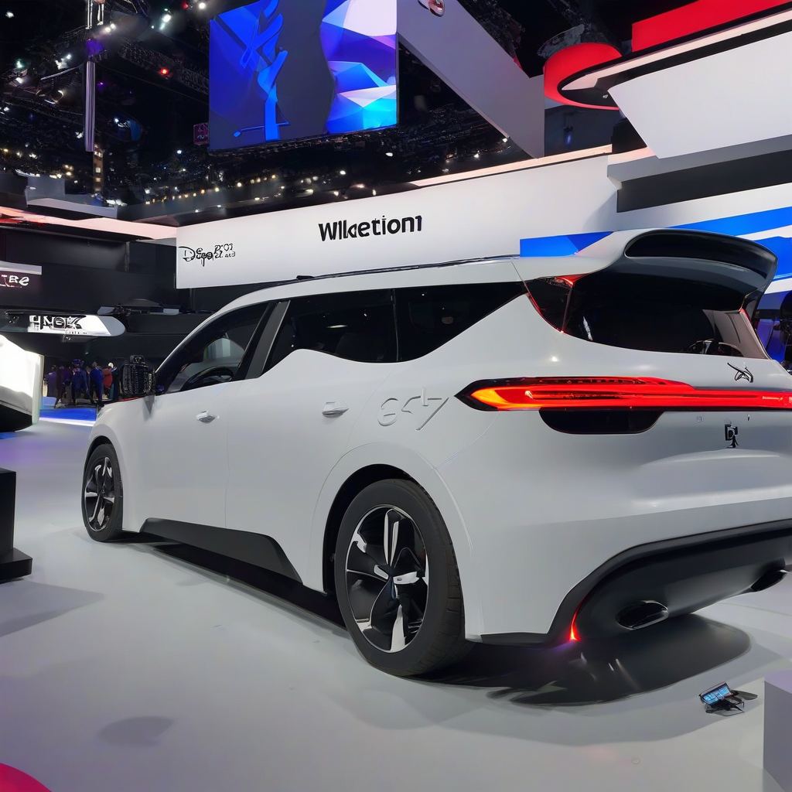

Title: "PS5's New Feature Steals the Spotlight at E3"
Date: 2024-09-05 07:15
Category: gaming

> This article is AI generated!
> 
> Title and text are generated with @cf/meta/llama-3.1-8b-instruct
> 
> Image is generated with @cf/stabilityai/stable-diffusion-xl-base-1.0
> 
> [Check out Cloudflare Workers AI](https://developers.cloudflare.com/workers-ai/models/)

This year's E3 was abuzz with excitement as Sony finally took the wraps off the highly anticipated PlayStation 5, its next-generation console that promises to revolutionize the gaming experience. While many gamers were hoping for flashy new graphics or a powerful new controller, the true star of the show turned out to be a lesser-known feature that stole the spotlight: the Zen Zone. This innovative new mode is designed to take care of players' mental well-being, providing a variety of calming activities and exercises to help reduce stress and anxiety.