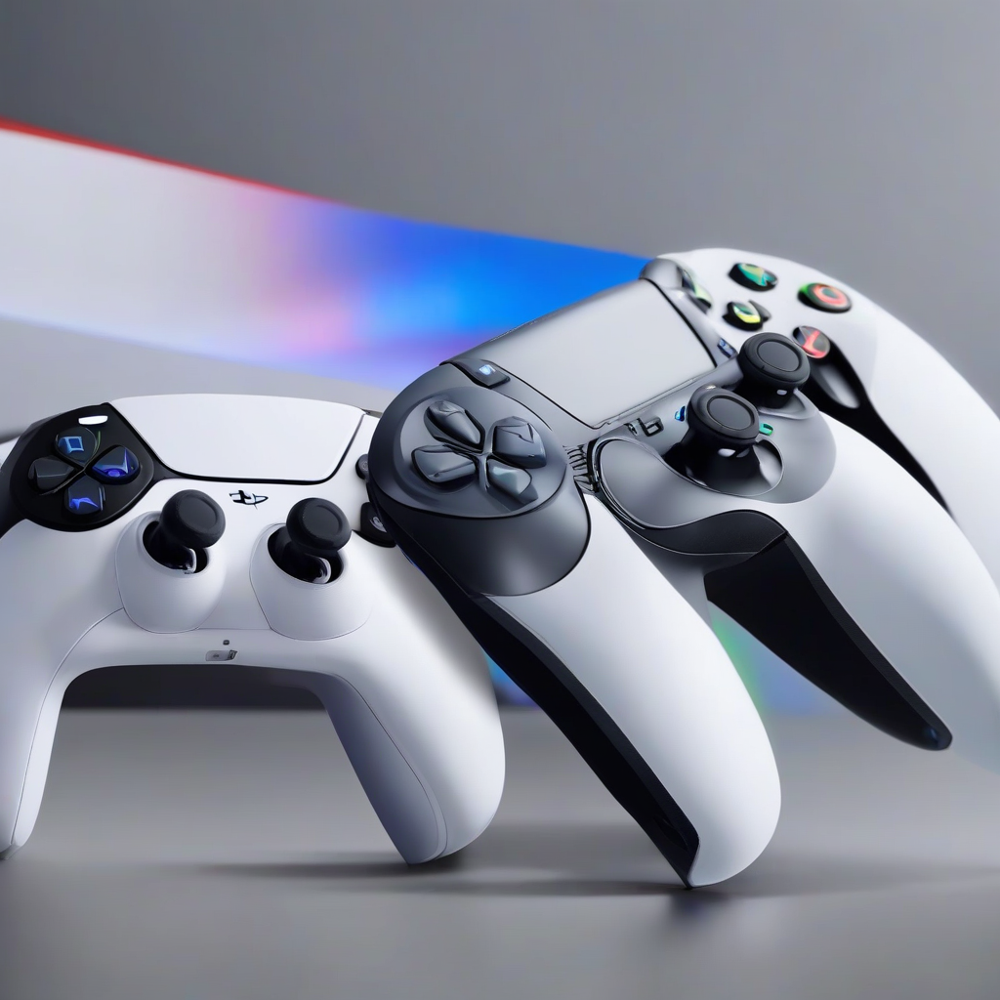

Title: "Shift in Power: PlayStation 5 Surpasses Xbox Sales"
Date: 2024-09-05 15:14
Category: gaming

> This article is AI generated!
> 
> Title and text are generated with @cf/meta/llama-3.1-8b-instruct
> 
> Image is generated with @cf/stabilityai/stable-diffusion-xl-base-1.0
> 
> [Check out Cloudflare Workers AI](https://developers.cloudflare.com/workers-ai/models/)

The latest gaming console sales figures have delivered a significant blow to Microsoft's Xbox brand, as Sony's PlayStation 5 has taken the lead in the console market. According to recent reports, the PS5 has sold more units than the Xbox Series X/S consoles, marking a major shift in the power dynamics between the two tech giants. This development is a testament to Sony's ability to innovate and adapt to the ever-changing gaming landscape.