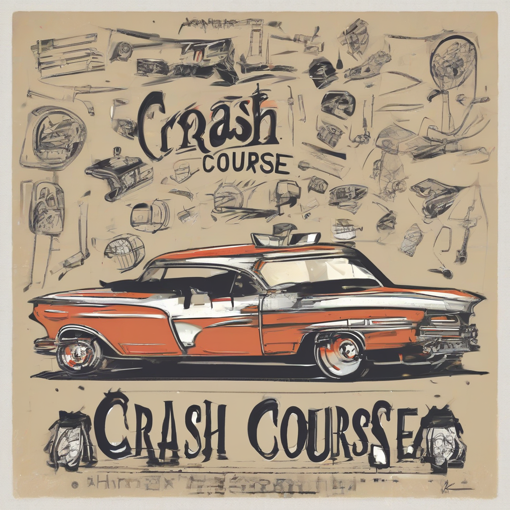

Title: "Crash Course"
Date: 2024-09-06 16:20
Category: autosports

> This article is AI generated!
> 
> Title and text are generated with @cf/meta/llama-3.1-8b-instruct
> 
> Image is generated with @cf/stabilityai/stable-diffusion-xl-base-1.0
> 
> [Check out Cloudflare Workers AI](https://developers.cloudflare.com/workers-ai/models/)

In the world of physical education, a crash course refers to an intensive and accelerated training session designed to teach individuals the fundamental skills and techniques of a particular sport or physical activity. This type of training is often used to prepare athletes for upcoming competitions or to help newcomers quickly learn the basics of a new sport. During a crash course, students are typically given hands-on instruction and intensive practice to master the skills and techniques required to excel in the activity. This can include demonstrations, drills, and group exercises that focus on proper form, technique, and movement.