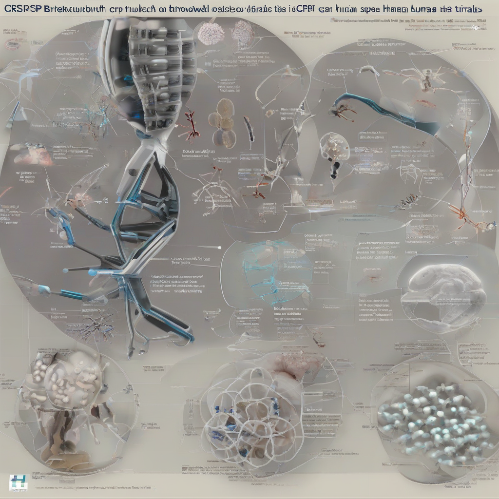

Title: "CRISPR Breakthrough Spreads to Human Trials"
Date: 2024-09-06 10:19
Category: biotech

> This article is AI generated!
> 
> Title and text are generated with @cf/meta/llama-3.1-8b-instruct
> 
> Image is generated with @cf/stabilityai/stable-diffusion-xl-base-1.0
> 
> [Check out Cloudflare Workers AI](https://developers.cloudflare.com/workers-ai/models/)

In a landmark development, researchers and scientists are taking a significant step forward in the field of gene editing, as CRISPR technology is being applied in human trials for the first time. After years of successful experiments in mice and cell cultures, the/editing technique is being tested on human subjects for the first time. This breakthrough represents a major milestone in the pursuit of treating and even curing genetic diseases, which affect millions of people worldwide. The initial trials are focused on gene editing treatments for sickle cell anemia and muscular dystrophy, two diseases that have long been resistant to conventional treatments.